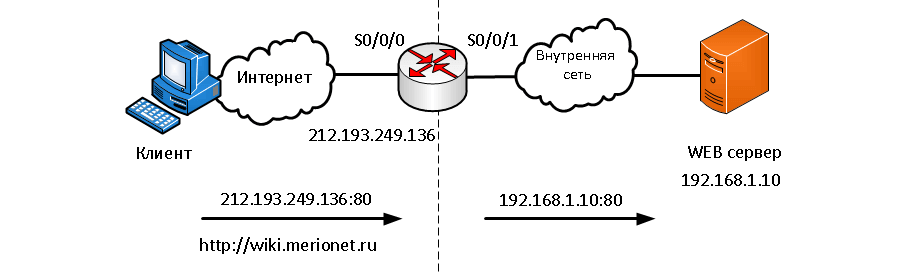

# Port Forwarding

**Port Forwarding** – или проброс портов, который также иногда называемый перенаправлением портов или туннелированием – это процесс пересылки трафика, адресованного конкретному сетевому порту с одного сетевого узла на другой. Этот метод позволяет внешнему пользователю достичь порта на частном **IPv4**-адресе (внутри локальной сети) извне, через маршрутизатор с поддержкой **NAT**.


## Настройка

Реализация перенаправления (проброса) портов с помощью команд IOS аналогична командам, используемым для настройки статического NAT. Переадресация портов - это, по существу, статическая трансляция NAT с указанным номером TCP или UDP-порта.

В общем виде основная команда выглядит так:

```
ip nat inside source {static   [tcp | udp]   [local_ip local_port]   [global_ip global_port]} [extendable]
```

где:

- **tcp** или **udp** – указывает это tcp или udp порт;
- **local_ip** – это ip адрес присвоенный хосту внутри сети;
- **local_port** – устанавливает локальный tcp/udp порт в диапазоне от 1 до 65535. Это номер порта, который слушает сервер;
- **global_ip** – это уникальный глобальный IP адрес внутреннего хоста, по которому клиенты в интернете будут связываться с ним;
- **global_port** – устанавливает глобальный tcp/udp порт в диапазоне от 1 до 65535. Это номер порта снаружи, по которому будут связываться клиенты;
- **extendable** – эта опция применяется автоматически. Она разрешает пользователю настраивать двойственные статические трансляции, если они идут на один и тот же адрес;


### Пример



Показана настройка для данной схемы, где **192.168.1.10** - внутренний локальный адрес IPv4 веб-сервера, прослушивающий **порт 80**. Пользователи получат доступ к этому внутреннему веб-серверу, используя глобальный IP-адрес **212.193.249.136**:, глобальный уникальный публичный IPv4-адрес. В этом случае это адрес интерфейса **Serial 0/0/1**. Глобальный порт настроен как **8080**. Это будет порт назначения, вместе с глобальным адресом **212.193.249.136** для доступа к внутреннему веб-серверу. Как и другие типы NAT, перенаправление портов требует конфигурации как внутренних, так и внешних NAT-интерфейсов.


## Проверка

```
Router# show ip nat translations

Pro	Inside Global		Inside Local		Outside local		Outside global
tcp	212.193.249.136:8080	192.168.1.10:80	212.193.249.17:46088	212.193.249.17:46088
tcp	212.193.249.136:8080	192.168.1.10:80	---			---
```


## Источники

https://wiki.merionet.ru/seti/14/port-forwarding-teoriya-i-nastrojka-cisco/