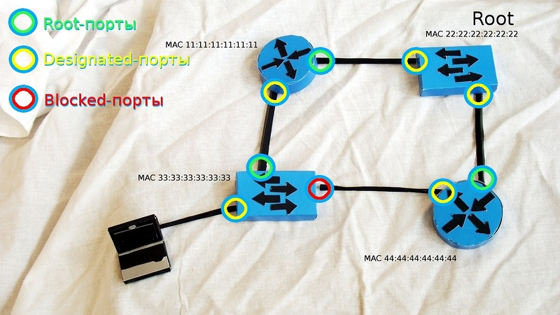

# STP

Основная задача STP — предотвратить появление петель на втором уровне.

Для обмена информацией между собой свитчи используют специальные пакеты, так называемые **BPDU** (Bridge Protocol Data Units).

- конфигурационные (**Configuration BPDU**)
- панические “ААА, топология поменялась!” **TCN** (**Topology Change Notification BPDU**)

Первые регулярно рассылаются **корневым свитчом** (и ретранслируются остальными) и используются для построения топологии, вторые, как понятно из названия, отсылаются в случае изменения топологии сети (проще говоря, подключении\отключении свитча).

Они шлют **BPDU** из всех работающих портов на *мультикастовый ethernet-адрес* **01-80-c2-00-00-00** (по умолчанию каждые 2 секунды), который прослушивают все свитчи с включенным STP.

## Формирование топологии

Сначала выбирается так называемый **корневой мост/свитч** (root bridge). Это устройство, которое STP считает точкой отсчета, центром сети; все дерево STP сходится к нему. Выбор базируется на таком понятии, как **идентификатор свитча** (Bridge ID). Bridge ID это число длиной 8 байт, которое состоит из Bridge Priority (приоритет, от 0 до 65535, по умолчанию 32768+номер vlan или инстанс MSTP, в зависимости от реализации протокола), и MAC-адреса устройства. В начале выборов каждый коммутатор считает себя корневым, о чем и заявляет всем остальным с помощью BPDU, в котором представляет свой идентификатор как ID корневого свитча. При этом, если он получает BPDU с меньшим Bridge ID, он перестает хвастаться своим и покорно начинает анонсировать полученный Bridge ID в качестве корневого. В итоге, корневым оказывается тот свитч, чей Bridge ID меньше всех.

> Такой подход таит в себе довольно серьезную проблему. Дело в том, что, при равных значениях Priority (а они равные, если не менять ничего) корневым выбирается самый старый свич, так как мак адреса прописываются на производстве последовательно, соответственно, чем мак меньше, тем устройство старше (естественно, если у нас все оборудование одного вендора). Понятное дело, это ведет к падению производительности сети, так как старое устройство, как правило, имеет худшие характеристики. Подобное поведение протокола следует пресекать, выставляя значение приоритета на желаемом корневом свиче вручную, об этом в практической части.

## Роли портов

После того, как коммутаторы померились айдями и выбрали root bridge, каждый из остальных свичей должен найти один, и только один порт, который будет вести к корневому свичу. Такой порт называется **корневым портом (Root port)**. Чтобы понять, какой порт лучше использовать, каждый некорневой свич определяет стоимость маршрута от каждого своего порта до корневого свича. Эта стоимость определяется **суммой стоимостей всех линков**, которые нужно пройти кадру, чтобы дойти до корневого свича. В свою очередь, **стоимость линка определяется просто- по его скорости** (чем выше скорость, тем меньше стоимость). Процесс определения стоимости маршрута связан с полем BPDU “Root Path Cost” и происходит так:

1. Корневой свич посылает BPDU с полем Root Path Cost, равным нулю

2. Ближайший свич смотрит на скорость своего порта, куда BPDU пришел, и добавляет стоимость согласно таблице

   | Скорость порта | Стоимость STP (802.1d) |
   | -------------- | ---------------------- |
   | 10 Mbps        | 100                    |
   | 100 Mbps       | 19                     |
   | 1 Gbps         | 4                      |
   | 10 Gbps        | 2                      |

3. Далее этот второй свич посылает этот BPDU нижестоящим коммутаторам, но уже с новым значением Root Path Cost, и далее по цепочке вниз

Если имеют место одинаковые стоимости (как в нашем примере с двумя свичами и двумя проводами между ними — у каждого пути будет стоимость 19) — корневым выбирается меньший порт.

Далее выбираются назначенные (**Designated**) порты. Из каждого конкретного сегмента сети должен существовать только один путь по направлению к корневому свичу, иначе это петля. В данном случае имеем в виду физический сегмент, в современных сетях без хабов это, грубо говоря, просто провод. Назначенным портом выбирается тот, который имеет лучшую стоимость в данном сегменте. У корневого свича все порты — назначенные.

И вот уже после того, как выбраны корневые и назначенные порты, оставшиеся блокируются, таким образом разрывая петлю.

