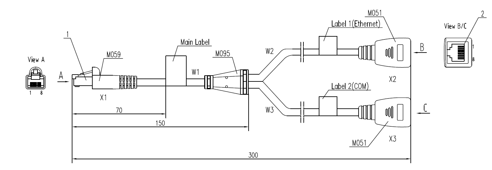

title: NE8000-M1A

# Huawei NetEngine 8000-M1A

## Подключение к устройству и первый запуск

Все маршрутизаторы Huawei NE8000 серии M имеют необычный совмещённый Ethernet(MGMT)/Console порт, называющийся **ETH/OAM**.

Данный порт имеет нестандартную распиновку, из-за чего без переходника он может работать только как 100M Ethernet MGMT интерфейс. Для подключения консольного кабеля, или консольного кабеля и MGMT одновременно, нужен специальный переходник **[ETH/OAM 1-into-2 Transfer Cable](ETH/OAM 1-into-2 Transfer Cable)**:



Если данный кабель отсутствует в комплекте, его можно изготовить самостоятельно из обычной витой пары, 3 RJ45 8P8C коннекторов и пары бочек (переходников RJ45 мама-мама):

1. Собрать кабель по следующей схеме (названия коннекторов написаны на схеме выше):

       | Пины ETH/OAM | Цвет меди       | Пины MGMT | Пины COM |
       | ------------ | --------------- | --------- | -------- |
       | X1.1         | Бело-зелёный    | X2.1      |          |
       | X1.2         | Зелёный         | X2.2      |          |
       | X1.3         | Бело-синий      | X2.3      |          |
       | X1.4         | Бело-оранжевый  |           | X3.5     |
       | X1.5         | Оранжевый       |           | X3.6     |
       | X1.6         | Синий           | X2.6      |          |
       | X1.7         | Бело-коричневый |           |          |
       | X1.8         | Коричневый      |           | X3.3     |

2. Подключить бочки к коннекторам X2, X3 (поскольку там нам нужна мама, а получился папа)

3. Промаркировать каждый конец кабеля, дабы не забыть где какой коннектор

4. PROFIT

!!! note "Примечание"
	Также можно заместо коннекторов X2 и X3 сразу использовать небольшие RJ45 розетки, если таковые найдутся

### Через mgmt интерфейс

По умолчанию MGMT интерфейс коммутатора введён в vpn-инстанс `__LOCAL_OAM_VPN__`, который ИЛИ отправляет DHCP-запросы, ИЛИ работает на стандартном IP 192.168.0.1/24, поэтому у вас есть возможность подключить его к вашей локальной сети с DHCP-сервером и подключится к нему по полученному им адресу, или же подключиться к нему напрямую по его стандартной адресации.

!!! note "Учётные данные для входа - `root / неизвестный пароль`"

### Через console интерфейс

Если есть возможность подключится к консольному интерфейсу, то в первую очередь маршрутизатор попросит установить отдельный пароль на линию `con0`:             

```bash
Please configure the login password (8-16)
Enter Password:
Confirm Password:
Info: Save the password now. Please wait for a moment.
```

!!! warning "Пароль устанавливается именно на линию `con0`, не на стандартного пользователя root"

После этого вы можете зайти на коммутатор и создать необходимых вам пользователей

## Информация о платформе

## Лицензирование

## Известные проблемы