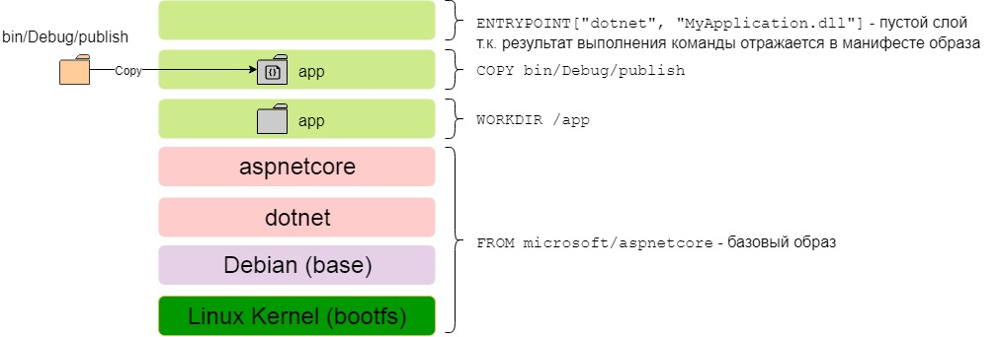

# Docker

**Docker** – это компактный инструмент виртуализации с открытым исходным кодом, работающий на уровне операционной системы, автоматизирующий развертывание приложений в контейнерах Linux и предоставляющий возможность упаковывать в контейнер приложение со всей необходимой структурой зависимостей (код, рабочая среда, библиотеки, переменные среды, файлы конфигурации). В отличие от виртуальных машин, разделяющих ресурсы физического хоста и обладающих собственной операционной системой, контейнер использует только часть операционной системы и представляет собой изолированную среду, процессы которой не оказывают влияние на работу за пределами контейнера. Это позволяет существенно снизить потребление ресурсов системы за счет выделения в контейнер только приложения и необходимых данных, а не обязательно целой операционной системы, как в виртуальной машине. Таким образом, контейнеры Linux обеспечивают быстрое развертывание приложений, облегчают тестирование, обслуживание и устранение неполадок, повышая безопасность.


Docker работает со следующими фундаментальными объектами:

- **Контейнер** – среда приложения. Каждый контейнер имеет в своей основе образ, содержащий необходимые данные конфигурации. При запуске контейнера из образа над этим образом надстраивается новый уровень с изменяемой структурой. Если сохранить изменения, сохраняется новый уровень образа, а старый остается неизменным.
- **Образ** – статический снимок состояния конфигурации контейнера. Образ – это неизменный слой, все изменения вносятся на самом высоком уровне и сохраняются только путем создания нового образа. Каждый образ зависит от одного или нескольких родительских образов.
- **Базовый образ** – образ, не имеющий родительских образов. Базовые образы определяют рабочую среду, пакеты и утилиты, необходимые для запуска приложения в контейнере.

Базовый образ нельзя изменять, поэтому все изменения отражаются в стеке образов, который над ним надстраивается.


## Установка

### Ubuntu

1. Обновить систему до актуального состояния

   ```
   sudo apt update && sudo apt upgrade
   ```

2. **(?)** Установить дополнительные пакеты ядра, которые позволяют использовать Aufs для контейнеров Docker. С помощью этой файловой системы мы сможем следить за изменениями и делать мгновенные снимки контейнеров:

   ```
   sudo apt install linux-image-extra-$(uname -r) linux-image-extra-virtual
   ```

3. Ещё надо установить пакеты, необходимые для работы apt по https:

   ````
   sudo apt install apt-transport-https ca-certificates curl software-properties-common
   ````

4. Для установки из официального репозитория необходимо добавить его ключ, а затем и сам репозиторий:

   ````
   curl -fsSL https://download.docker.com/linux/ubuntu/gpg | sudo apt-key add -
   
   sudo add-apt-repository "deb [arch=amd64] https://download.docker.com/linux/ubuntu bionic stable"
   sudo apt update && apt-cache policy docker-ce
   ````

5. Установка Docker на Ubuntu:

   ```
   sudo apt install -y docker-ce
   ```


Чтобы завершить установку осталось добавить нашего пользователя в группу ***docker***. Иначе при запуске утилиты вы будете получать ошибку подключения к сокету:

```
sudo usermod -aG docker $(whoami)
```

> **Важно:** Каждый пользователь в группе `docker` имеет права, равноценные правам суперпользователя.


### CentOS

1. Устанавливаем **wget**:

   ```
   dnf install wget
   ```

2. Скачиваем конфигурационный файл для репозитория докер:

   ```
   wget -P /etc/yum.repos.d/ https://download.docker.com/linux/centos/docker-ce.repo
   ```

3. Теперь устанавливаем **docker**:

   ```
   dnf install docker-ce docker-ce-cli
   ```

4. И разрешаем автозапуск сервиса и стартуем его:

   ```
   systemctl enable docker --now
   ```

   

### Docker-compose

Сейчас работа с docker не обходится без утилиты управления контейнерами **docker compose**, давайте её тоже установим:

```
sudo curl -L "https://github.com/docker/compose/releases/download/1.25.0/docker-compose-$(uname -s)-$(uname -m)" -o /usr/local/bin/docker-compose
sudo chmod +x /usr/local/bin/docker-compose
```

, где - **1.25.0** версия файлов. На **23.04** свежайшая версия - [1.29.1](https://github.com/docker/compose/releases/tag/1.29.1)

Утилита была загружена из официального сайта и теперь вы можете посмотреть её версию:

```
docker-compose --version
```


## Файлы

* `/var/lib/docker/` - хранилище компонентов **Docker** (сети, тома, образы и тд.)


## Синтаксис и управление

Все действия с контейнерами выполняются утилитой **`docker`**. Ее можно запускать от имени вашего пользователя после того, как он был добавлен в группу программы. Синтаксис утилиты очень прост:

```
$ docker [опции] [команда] [опции_команды] [аргументы]
```


### Опции

* **-D** - включить режим отладки;
* **-H** - подключиться к серверу, запущенному на другом компьютере;
* **-l** - изменить уровень ведения логов, доступно: debug,info,warn,error,fatal;
* **-v** - показать версию;
* **--help** вывести справку по команде или утилите в целом;


### Команды управления

* **builder** - управление сборкой;
* **config** - управление конфигурацией;
* **container** - управление контейнерами;
* **engine** - управление движком;
* **image** - управление образами;
* **network** - управление сетью;
  * `ls` - список существующих сетей
* **node** - управление узлами в режиме «роя» (Swarm – инструмент кластеризации, позволяющий объединить несколько хостов в единый виртуальный хост);
* **plugin** - управление дополнениями;
* **secret** - управление защищенными данными;
* **service** - управление службами;
* **stack** - управление стеками образов;
* **swarm** - управление режимом «роя»;
* **system** - управление системой;
* **trust** - управление доверием (подпись образов, отзыв подписи, определение разрешений на подпись и т.д.);
* **volume** - управление томами (подключаемыми к контейнеру элементами файловой системы).


### Команды

* **attach** - подключиться к запущенному контейнеру;
* **build** - собрать образ из инструкций *dockerfile*;
* **commit** - создать новый образ из изменений контейнера;
* **cp** - копировать файлы между контейнером и файловой системой;
* **create** - создать новый контейнер;
* **diff** - проверить файловую систему контейнера;
* **events** - посмотреть события от контейнера;
* **exec** - выполнить команду в контейнере;
* **export** - извлечь содержимое контейнера в архив;
* **history** - посмотреть историю изменений образа;
* **images** - список установленных образов;
* **import** - создать контейнер из архива tar;
* **info** - посмотреть информацию о системе;
* **inspect** - посмотреть информацию о контейнере;
* **kill** - остановить запущенный контейнер;
* **load** - загрузить образ из архива;
* **login** - авторизация в официальном репозитории Docker;
* **logout** - выйти из репозитория Docker;
* **logs** - посмотреть логи контейнера;
* **pause** - приостановить все процессы контейнера;
* **port** - подброс портов для контейнера;
* **ps** - список запущенных контейнеров;
  * **-a** - вывод в том числе уже отработавших контейнеров;
  * **-q** - вывод ID контейнеров;
* **pull** - скачать образ контейнера из репозитория;
* **push** - отправить образ в репозиторий;
* **restart** - перезапустить контейнер;
* **rm** - удалить контейнер;
* **rmi** - удалить образ;
* **run** - выполнить команду в контейнере;
  * **-e** - переменные окружения для команды (`-e "FOO=bar"`, в данном случае, переменная окружения **FOO** будет иметь значение **bar**);
  * **-p** - соответсвие порта локальной машины к порту контейнера ( `-p 80:8080`);
  * **-d** - работа контейнера в фоне;
  * **-h** - имя хоста контейнера;
  * **-i** - интерактивный режим, связывающий stdin терминала с командой;
  * **-m** - ограничение памяти для команды;
  * **-u** - пользователь, от имени которого будет выполнена команда;
  * **-t** - связать tty с контейнером для работы ввода и вывода;
  * **-v** - примонтировать директорию основной системы в контейнер (`-v /var/test:/mnt/test`);
  * **--rm** - после завершения приложения в контейнере, либо после остановки, контейнер удалиться;
  * **--name** - задает имя для контейнера.
* **save** - сохранить образ в архив tar;
* **search** - поиск образов в репозитории по заданному шаблону;
* **start** - запустить контейнер;
* **stats** - статистика использования ресурсов контейнером;
* **stop** - остановить контейнер;
* **top** - посмотреть запущенные процессы в контейнере;
* **unpause** - проложить выполнение процессов в контейнере.


## Использование

Для первого запуска можно использовать контейнер **Hello World**. После запуска, если образ не будет обнаружен локально, он автоматически начнет загружаться с **Docker Hub**.

```
root@ubuntu-docker:~# docker run hello-world

Hello from Docker!
This message shows that your installation appears to be working correctly.

To generate this message, Docker took the following steps:
 1. The Docker client contacted the Docker daemon.
 2. The Docker daemon pulled the "hello-world" image from the Docker Hub.
    (amd64)
 3. The Docker daemon created a new container from that image which runs the
    executable that produces the output you are currently reading.
 4. The Docker daemon streamed that output to the Docker client, which sent it
    to your terminal.

To try something more ambitious, you can run an Ubuntu container with:
 $ docker run -it ubuntu bash

Share images, automate workflows, and more with a free Docker ID:
 https://hub.docker.com/

For more examples and ideas, visit:
 https://docs.docker.com/get-started/
```


### Поиск и установка контейнеров

Использование **`docker`** очень простое по своей сути. Если вы не знаете название нужного пакета, можете воспользоваться поиском, например, найдем **Ubuntu**:

```shell
docker search ubuntu
```

Утилита выведет список всех доступных для загрузки образов из репозитория Docker, которые содержат такое слово. Колонка **Official** означает, что образ поддерживается официальным разработчиком, а **Stars** - это количество пользователей, которым этот образ понравился.


Чтобы загрузить контейнер необходимо использовать команду **`pull`**:

```
docker pull ubuntu
```

Посмотреть список установленных образов:

````
root@ubuntu-docker:~# docker images

REPOSITORY    TAG       IMAGE ID       CREATED       SIZE
hello-world   latest    d1165f221234   6 weeks ago   13.3kB
````


### Запуск контейнера

```
# -i и -t опции для интерактивного доступа

root@ubuntu-docker:~# docker run -it ubuntu

root@e2856a5d92df:/# ls
bin  boot  dev  etc  home  lib  lib32  lib64  libx32  media  mnt  opt  proc  root  run  sbin  srv  sys  tmp  usr  var
root@e2856a5d92df:/# whoami
root
```

Вы в окружении контейнера. У вас есть права суперпользователя, но вы не можете получить доступ к основной системе. Контейнер содержит минимум необходимых файлов, нет даже текстовых редакторов.


### Сохранение изменений

Вы можете изменять контейнер как захотите, добавлять и удалять программы и многое другое. Но когда вы его удалите, все изменения будут потеряны. Вы можете создать новое образ из модифицированного контейнера, для этого используется команда commit. На основе ID контейнера выполняем команду:

```
docker ps
docker commit -m "изменения" -a "автор" ид_контейнера repository/имя

docker commit -m "Zenity" -a "Seriyyy95" d034b794a3bf repository/ubuntu-zenity
```


### Удаление контейнеров

Данная комбинация команд используется для удаления всех доступных и неактивных контейнеров

```
docker rm $(docker ps -aq)
```


### Dockerfile

Dockerfile представляет собой набор инструкций, на основе которых строится новый образ. Каждая инструкция добавляет новый слой к образу. Пример:

```
FROM microsoft/aspnetcore
WORKDIR /app
COPY bin/Debug/publish .
ENTRYPOINT["dotnet", "MyApplication.dll"]
```

Рассмотрим отдельно каждую инструкцию:

1. Определяем базовый образ, на основе которого будем строить свой. В данном случае берем **microsoft/aspnetcore** — официальный образ от **Microsoft**, который можно найти на [DockerHub](https://hub.docker.com/r/microsoft/aspnetcore/);
2. Задаем рабочую директорию внутри образа;
3. Копируем предварительно спаблишенное приложение **MyApplication** в рабочую директорию внутри образа. Сначала пишется исходная директория — путь относительно контекста, указанного в команде `docker build`, а вторым аргументом — целевая директория внутри образа, в данном случае точка обозначает рабочую директорию;
4. Конфигурируем контейнер как исполняемый: в нашем случае для запуска контейнера будет выполнена команда `dotnet MyApplication.dll`.

Если в директории с Dockerfile выполнить команду `docker build`, то мы получим образ на основе microsoft/aspnetcore, к которому будет добавлено еще три слоя.




### Volume

Создание тома:

````
docker volume create [name]
````

Привязка к контейнеру:

```
docker run -v [name]:/var/test [name_container]
```

Список томов **`docker volume ls`**:

```
root@ubuntu-docker:~# docker volume ls

DRIVER    VOLUME NAME
local     7e2b5fa030f7cbfca4fee4c927da9d3854d0ea8eace9e4e52111562051038271
local     7e236169171e09bc9879ffc198f8ef114d63610e2a9e9e51e3427ce0d820099e
local     183bcddbae8eff9f6874bab49f0fac065d47ea50a906f06c62085d6d2ebe6028
local     b4ea5401e7ff75c99dd84fbcb179b8011a7d49900e9ad7ecc270a6df76ec3dd9
local     c0b9651293b00fa59c933b92744a8ac82dd1acd3fceb0997c39d621874c7ccbe
```

Подробнее про определенный том **`docker volume inspect [volume name]`**

```
root@ubuntu-docker:~# docker volume inspect 7e2b5fa030f7cbfca4fee4c927da9d3854d0ea8eace9e4e52111562051038271
[
    {
        "CreatedAt": "2021-04-21T06:52:09Z",
        "Driver": "local",
        "Labels": null,
        "Mountpoint": "/var/lib/docker/volumes/7e2b5fa030f7cbfca4fee4c927da9d3854d0ea8eace9e4e52111562051038271/_data",
        "Name": "7e2b5fa030f7cbfca4fee4c927da9d3854d0ea8eace9e4e52111562051038271",
        "Options": null,
        "Scope": "local"
    }
]
```


## Docker-compose

В директории проекта может находится файл docker-compose.yaml, который хранит в себе параметры запуска контейнеров. Файл использует синтаксис YAML и должен содержать такие данные:

```
version: 'версия'
networks:
  сети
volumes:
  хранилища
services:
  контейнеры
```

Версия указывает на версию синтаксиса файла, в разных версиях доступны разные ключевые слова, это сделано для обратной совместимости. Мы будем использовать версию 3.5. Далее нужно перечислить хранилища (volumes), сети (networks) и сами контейнеры.

Синтаксис YAML использует "**ключ : значение**", разделенные двоеточием, только тут значение может быть вообще нулевым, может содержать другие ключи, а также оно может быть массивом значений, тогда каждый элемент массива начинается с чёрточки "-".  Очень важны отступы, чтобы показать вложенность значений, поэтому не теряйте их.


### Compose-файл

#### База

Директория с файлом будет считаться корневой директорией проекта

````
mkdir losst-docker
vi losst-docker/docker-compose.yaml
~
version: '3.5'
services:
````

#### Объявление контейнера

````
version: '3.5'
volumes:
  db_vol:
networks:
  docker_net:
services:
  docker-nginx:
    image: nginx
    ports:
      - '80:80'
    volumes:
      - ./:/usr/share/nginx/html/
  docker-mysql:
    image: mysql
    volumes:
      - db_vol:/var/lib/mysql
    environment:
      - MYSQL_ROOT_PASSWORD=password
      - MYSQL_DATABASE=database
      - MYSQL_USER=user
      - MYSQL_PASSWORD=password
    networks:
      - docker_net
  docker-phpmyadmin:
    image: phpmyadmin/phpmyadmin:latest
    ports:
      - '8080:80'
    environment:
      - PMA_HOST=docker-mysql
    networks:
      - docker_net
````

* `docker-nginx` - название контейнера.

* `image` - название образа. Если не присутствует локально, то будет скачан из **Docker Hub** последней (latest) версии.

* `ports` - проброс портов (соответствие локального порта порту в контейнере: **'8080:80'**).

* `volumes` - подключение **томов** (volume) для проброса данных. Работает по принципу "локальный:удаленный". 

  Для подключения именованных хранилищ  (`db_vol`) необходимо сделать объявление и указать его использование в конкретном контейнере. Подключение именованного хранилища: "**название хранилища:путь в контейнере**".

* `networks` - создание сети для общеня контейнеров. Новую сеть необходимо объявить в шапке и указать ее на всех контейнерах, которые необходимо связать.


#### Выполнение команд в контейнере

С помощью **docker-compose** можно подключиться к любому контейнеру из группы. Для этого просто используйте команду exec. Необходимо запустить контейнер в фоновом (`-d`) режиме и выполнить команду `docker-compose exec` с указанием **имени сервиса из файла docker-compose.yaml** и самой командой для выполнения.

```
docker-compose up -d
```

И используйте `docker-compose exec`. Подключимся к контейнеру с **Nginx**:

```
docker-compose exec docker-nginx /bin/bash


root@ubuntu-docker:~/test-docker# docker-compose exec docker-nginx /bin/bash

root@d243ec149a8d:/# whoami
root

root@d243ec149a8d:/# hostname
d243ec149a8d

root@d243ec149a8d:/# service nginx status
[ ok ] nginx is running.
```


## Запуск контейнера

Необходимо перейти в директорию, где находится конифгурационный файл и выполнить команду **`docker-compose up`**. Для запуска в фоне используется опция **`-d`**.


### 


## Источники

* https://habr.com/ru/post/353238/

* https://habr.com/ru/post/310460

https://wiki.archlinux.org/index.php/Docker_(%D0%A0%D1%83%D1%81%D1%81%D0%BA%D0%B8%D0%B9)

https://www.digitalocean.com/community/tutorials/how-to-install-and-use-docker-on-ubuntu-20-04-ru

https://losst.ru/ustanovka-docker-na-ubuntu-16-04

https://losst.ru/ispolzovanie-docker-dlya-chajnikov

https://www.dmosk.ru/miniinstruktions.php?mini=docker-install-linux

https://www.dmosk.ru/miniinstruktions.php?mini=docker-self-image

* https://www.dmosk.ru/miniinstruktions.php?mini=docker-webserver

https://itproffi.ru/docker-chast-1-ustanovka-nastrojka-i-nachalo-raboty/

https://www.youtube.com/watch?v=QF4ZF857m44

https://youtu.be/QF4ZF857m44?t=3644

