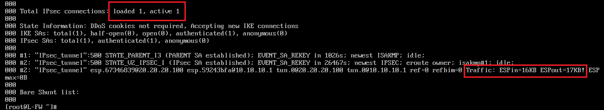

### IPsec

---

#### Установка

* CentOS

  `dnf isntall libreswan`

* Debian

  `...`


#### Файлы

* `/etc/ipsec.d` - директория для файлов конфигурации
  * `*.conf` - файл конфигурации для создания соединения
  * `*.secrets` - файл хранящий секретный ключ


#### Конфигурация

1. После установки необходимо создать файл `*.conf` в директории `/etc/ipsec.d` и указать в нем необходимые параметры соединения

   ```c
   conn GRE-over-IPsec
   	auto=start
   	type=tunnel
   	authby=secret
   	ike=3des-sha1;dh14
   	esp=aes-sha2
   	left=10.10.10.1
   	right=20.20.20.100
   	leftprotoport=gre
   	rightprotoport=gre
   	pfs=no
   ```

   , где -

   * **Раздел conn** содержит спецификацию соединения, определяющую сетевое соединение, которое должно быть сделано с использованием IPsec. Данное имя является произвольным и используется для идентификации соединения.
   * `auto=start` означает, что даже после перезагрузки произойдет согласование соединения.
   * `type=tunnel` — тип соединения туннель (Host-to-Host соединение).
   * `authby=secret` означает, что аутентификация будет по секретному ключу.
   * `ike=3des-sha1;dh14` — настройка фазы ike, вся информация дается в задании. Шифрование 3DES. Проверка целостности SHA-1. Группа Диффи — Хеллмана 14 (2048).
   * `esp=aes-sha2` — настройка второй фазы.
   * `left=20.20.20.100` — Local IP-адрес.
   * `right=10.10.10.1` — Remote IP-адрес.
   * `leftprotoport=gre` и `rightprotoport=gre` — используем протокол GRE.
   * `pfs=no` — прямая секретность ключа. Иногда возникает проблема из-за этой настройки. Выключаем  

2. После чего, если используется аутентификация по секретному ключу, необходимо создать в той же директории файл `*.secrets`

   ```c
   10.10.10.1 20.20.20.100 : PSK "WSR-2019"
   ```

   , где -

   * `10.10.10.1` - локальный адрес
   * `20.20.20.100` - удаленный адрес
   * `: PSK`
   * `"WSR-2019"` - ключ

3. Затем необходимо повторить те же действия на противоположном хосте, поменяв местами адрес **источника** и **назначения**

4. После завершения конфигурации, необходимо включить автозапуск и запустить сервис

   ```c
   systemctl enable ipsec
   systemctl start ipsec
   ```

5. Для применения настроек необходимо перезапустить сервис командой `ipsec restart`


#### Проверка

`ipsec status` - пункт **"Total IPsec connections"** должен содержать **одно загруженное** и **одно активное** соединение

