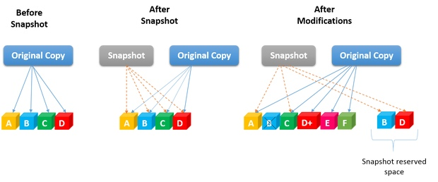

## LVM (Logical Volume Manager)

---

**LVM** или **Logical Volume Manager** - это еще один программный уровень абстракции над физическими разделами жесткого диска, который позволяет создавать логические тома для хранения данных без непосредственной переразметки жесткого диска на одном или нескольких жестких дисках. LVM увеличивает удобство работы с жестким диском, аппаратные особенности работы скрываются программным обеспечением, поэтому вы можете изменять размеры дисков, перемещать их на лету, без остановки приложений или размонтирования файловых систем. Это очень удобно на серверах, вы можете добавить еще один диск или расширить существующие lvm тома на лету.


### Установка

* **Debian / CentOS**

  `apt install lvm2`


### Использование

#### Инициализация физических томов

(раздела на диске или весь физическй диск) (*pv - physical volume*)

1. Находим диски (sdb, sdc, sdd)

   ```bash
   [root@centos-vm ~]# lsblk
   NAME        MAJ:MIN RM  SIZE RO TYPE MOUNTPOINT
   sda           8:0    0   20G  0 disk
   ├─sda1        8:1    0    1G  0 part /boot
   └─sda2        8:2    0   19G  0 part
     ├─cl-root 253:0    0   17G  0 lvm  /
     └─cl-swap 253:1    0    2G  0 lvm  [SWAP]
   sdb           8:16   0    5G  0 disk
   sdc           8:32   0    5G  0 disk
   sdd           8:48   0    2G  0 disk
   ```

2. Инициализируем в **lvm** при помощи **`pvcreate`**

   ```bash
   [root@centos-vm ~]# pvcreate /dev/sdb /dev/sdc /dev/sdd
     Physical volume "/dev/sdb" successfully created.
     Physical volume "/dev/sdc" successfully created.
     Physical volume "/dev/sdd" successfully created.
   ```

##### Проверка

- **`pvscan`**

  ```bash
  [root@centos-vm ~]# pvscan
    PV /dev/sda2   VG cl              lvm2 [<19.00 GiB / 0    free]
    PV /dev/sdb                       lvm2 [5.00 GiB]
    PV /dev/sdc                       lvm2 [5.00 GiB]
    PV /dev/sdd                       lvm2 [2.00 GiB]
    Total: 4 [<31.00 GiB] / in use: 1 [<19.00 GiB] / in no VG: 3 [12.00 GiB]
  ```

- **`pvs`**

  ```bash
  [root@centos-vm ~]# pvs
    PV         VG         Fmt  Attr PSize   PFree
    /dev/sda2  cl         lvm2 a--  <19.00g     0
    /dev/sdb   group1_lvm lvm2 a--   <5.00g  3.99g
    /dev/sdc   group1_lvm lvm2 a--   <5.00g     0
    /dev/sdd   group1_lvm lvm2 a--   <2.00g <2.00g
  ```

- **`pvdisplay`**

  ```shell
  [root@centos-vm ~]# pvdisplay
    --- Physical volume ---
    PV Name               /dev/sda2
    VG Name               cl
    PV Size               <19.00 GiB / not usable 3.00 MiB
    Allocatable           yes (but full)
    PE Size               4.00 MiB
    Total PE              4863
    Free PE               0
    Allocated PE          4863
    PV UUID               XWc2Vs-JmQx-T2lz-a7GP-RkGC-v1Ga-51132b
  
    "/dev/sdb" is a new physical volume of "5.00 GiB"
    --- NEW Physical volume ---
    PV Name               /dev/sdb
    VG Name
    PV Size               5.00 GiB
    Allocatable           NO
    PE Size               0
    Total PE              0
    Free PE               0
    Allocated PE          0
    PV UUID               6fNJeq-Nko5-jdYD-T5Dj-wZRA-a5h9-2tajv7
  ```

  ** где* 

  - **PV Name** — имя диска.
  - **VG Name** — группа томов, в которую входит данный диск (в нашем случае пусто, так как мы еще не добавили его в группу).
  - **PV Size** — размер диска.
  - **Allocatable** — распределение по группам. Если NO, то диск еще не задействован и его необходимо для использования включить в группу.
  - **PE Size** — размер физического фрагмента (экстента). Пока диск не добавлен в группу, значение будет 0.
  - **Total PE** — количество физических экстентов.
  - **Free PE** — количество свободных физических экстентов.
  - **Allocated PE** — распределенные экстенты.
  - **PV UUID** — идентификатор физического раздела.


#### Создание группы томов LVM

(*vg - volume group*)

**Группа томов** - это не что иное, как пул памяти, который будет распределен между логическими томами и может состоять из нескольких физических разделов.

1. Создаем группу при помощи `vgcreate`

   ```bash
   
   [root@centos-vm ~]# vgcreate group1_lvm /dev/sdb /dev/sdc /dev/sdd
     Volume group "group1_lvm" successfully created
   ```

   , где -

   - **`group1_lvm`** - название будущей группы

##### Проверка

- **`vgscan`**

  ```
  [root@centos-vm ~]# vgscan
    Found volume group "group1_lvm" using metadata type lvm2
    Found volume group "cl" using metadata type lvm2
  ```

- **`vgs`**

  ```
   [root@centos-vm ~]# vgs
     VG         #PV #LV #SN Attr   VSize   VFree
     cl           1   2   0 wz--n- <19.00g     0
     group1_lvm   3   2   0 wz--n- <11.99g <5.99g
  ```

- **`vgdisplay`**

  ```bash
  [root@centos-vm ~]# vgdisplay
    --- Volume group ---
    VG Name               group1_lvm
    System ID
    Format                lvm2
    Metadata Areas        3
    Metadata Sequence No  2
    VG Access             read/write
    VG Status             resizable
    MAX LV                0
    Cur LV                0
    Open LV               0
    Max PV                0
    Cur PV                3
    Act PV                3
    VG Size               <11.99 GiB
    PE Size               4.00 MiB
    Total PE              3069
    Alloc PE / Size       0 / 0
    Free  PE / Size       3069 / <11.99 GiB
    VG UUID               mYfsEl-mzBm-jL0Z-tXFe-RSGz-g2oO-eGElkF
  ```

  ** где:*

  - **VG Name** — имя группы.
  - **Format** — версия подсистемы, используемая для создания группы.
  - **Metadata Areas** — область размещения метаданных. Увеличивается на единицу с созданием каждой группы.
  - **VG Access** — уровень доступа к группе томов.
  - **VG Size** — суммарный объем всех дисков, которые входят в группу.
  - **PE Size** — размер физического фрагмента (экстента).
  - **Total PE** — количество физических экстентов.
  - **Alloc PE / Size** — распределенное пространство: колическтво экстентов / объем.
  - **Free  PE / Size** — свободное пространство: колическтво экстентов / объем.
  - **VG UUID** — идентификатор группы.


#### Создание логических томов LVM

(*lv - logical volume*)

1. Создаем логический том при помощи `lvcreate [опции] <имя группы томов>`

   Опции:

   * `-l` - размер в блоках
   * `-L` - размер в байтах
     * **B** - байты;
     * **K** - килобайты;
     * **M** - мегабайты;
     * **G** - гигабайты;
     * **T** - терабайты.
   * `-n` - наименование

   

   Логический том **logical_vol1** размером 500 Мб

   ```bash
   [root@centos-vm ~]# lvcreate -L 500M -n logical_vol1 group1_lvm
     Logical volume "logical_vol1" created.
   ```

   Логический том использующий **40%** от дискового пространства группы **vg01**.

   ```
   lvcreate -l 40%VG vg01
   ```

   Том использующй все свободное пространство группы **vg01** при создании логического тома.

   ```
   lvcreate -l 100%FREE vg01
   ```

   *также можно использовать **%PVS** — процент места от физического тома (PV); **%ORIGIN** — размер оригинального тома (применяется для снапшотов).*

##### Проверка

* **`lvscan`**

  ```
  [root@centos-vm ~]# lvscan
    ACTIVE            '/dev/group1_lvm/logical_vol1' [500.00 MiB] inherit
  ```

* **`lvs`**

  ```
  [root@centos-vm ~]# lvs
    LV           VG         Attr       LSize   Pool Origin Data%  Meta%  Move Log Cpy%Sync Convert
    root         cl         -wi-ao---- <17.00g
    swap         cl         -wi-ao----   2.00g
    logical_vol1 group1_lvm -wi-ao----   1.00g
    logical_vol2 group1_lvm -wi-a-----   5.00g
  ```

* **`lvdisplay`**

  ```
  [root@centos-vm ~]# lvdisplay
    --- Logical volume ---
    LV Path                /dev/group1_lvm/logical_vol1
    LV Name                logical_vol1
    VG Name                group1_lvm
    LV UUID                wkfoTg-kEPc-4QJJ-Gtza-LtwD-C3mY-nm7Y7N
    LV Write Access        read/write
    LV Creation host, time centos-vm, 2021-02-17 12:05:47 +0700
    LV Status              available
    # open                 0
    LV Size                500.00 MiB
    Current LE             125
    Segments               1
    Allocation             inherit
    Read ahead sectors     auto
    - currently set to     8192
    Block device           253:2
  ```

  ** где:*

  - **LV Path** — путь к устройству логического тома.
  - **LV Name** — имя логического тома.
  - **VG Name** — имя группы томов.
  - **LV UUID** — идентификатор.
  - **LV Write Access** — уровень доступа.
  - **LV Creation host, time** — имя компьютера и дата, когда был создан том.
  - **LV Size** — объем дискового пространства, доступный для использования.
  - **Current LE** — количество логических экстентов.


#### Форматирование тома и его монтирование

1. Форматирование `mkfs`

   ````
   [root@centos-vm ~]# mkfs.ext4 /dev/group1_lvm/logical_vol1
   mke2fs 1.45.4 (23-Sep-2019)
   Creating filesystem with 512000 1k blocks and 128016 inodes
   Filesystem UUID: 70bdd3f9-6831-44b2-a5c5-c3625611fa78
   Superblock backups stored on blocks:
           8193, 24577, 40961, 57345, 73729, 204801, 221185, 401409
   
   Allocating group tables: done
   Writing inode tables: done
   Creating journal (8192 blocks): done
   Writing superblocks and filesystem accounting information: done
   ````

##### Монтирование

1. Разовое `mount`

   ```bash
   [root@centos-vm ~]# mount /dev/group1_lvm/logical_vol1 /mnt
   ```

2. `fstab`

   ```
   [root@centos-vm ~]# nano /etc/fstab
   ...
   /dev/vg01/lv01  /mnt    ext4    defaults        1 2
   ```

   ** в данном примере мы монтируем при загрузке системы том **/dev/vg01/lv01** в каталог **/mnt**; используется файловая система **ext4**.*

###### Проверка

* `mount -a`
* `df -hT`


#### Удаление LVM раздела

Вы можете не только настроить LVM тома изменяя их размер и атрибуты, но и удалить LVM раздел, если он вам больше не нужен. Это делается с помощью LVM команды **lvremove**:

```
sudo lvremove /dev/vol-grp1/lv_mirror
```


#### Увеличение томов

Увеличение размера тома может выполняться с помощью добавления еще одного диска или при увеличении имеющихся дисков (например, увеличение диска виртуальной машины). Итак, процедура выполняется в **4 этапа**:

##### Расширение физического тома

Расширение физического раздела можно сделать за счет **добавление нового диска** или **увеличение дискового пространства имеющегося** (например, если диск виртуальный).

* **Добавление нового диска**

  1. Инициализируем диск:

     ```
     pvcreate /dev/sdd
     ```

     ** в данном примере мы инициализировали диск **sdd**.*

* **Увеличение дискового пространства имеющегося диска (виртуальный диск)**

  1. Увеличиваем размер физического диска командой:

     ```
     pvresize /dev/sda
     ```

     ** где **/dev/sda** — диск, который был увеличен.*


##### Добавление нового диска к группе томов

Независимо от способа увеличения физического тома, расширяем группу томов командой:

```
vgextend vg01 /dev/sdd
```

** данная команда расширит группу **vg01** за счет добавленого или расширенного диска **sdd**.*


##### Увеличение логического раздела

Выполняется одной командой.

**а) все свободное пространство:**

```
lvextend -l +100%FREE /dev/vg01/lv01
```

** данной командой мы выделяем все свободное пространство группы томов **vg01** разделу **lv01**.*

**б) определенный объем:**

```
lvextend -L+30G /dev/vg01/lv01
```

** данной командой мы добавляем 30 Гб от группы томов **vg01** разделу **lv01**.*

**в) до нужного объема:**

```
lvextend -L500G /dev/vg01/lv01
```

** данной командой мы доводим наш раздел до объема в 500 Гб.*

**Проверка**

Проверка командой `lvdisplay`. Обратить внимание нужно на опцию **LV Size**


##### Увеличение размера файловой системы

Чтобы сама система увидела больший объем дискового пространства, необходимо увеличить размер файловой системы.

**Посмотреть используемую файловую систему:**

```
df -T
```

Для каждой файловой системы существуют свои инструменты.

**ext2/ext3/ext4:**

```
resize2fs /dev/vg01/lv01
```

**XFS:**

```
xfs_growfs /dev/vg01/lv01
```

**Reiserfs:**

```
resize_reiserfs /dev/vg01/lv0
```


#### Уменьшение томов

> Размер некоторый файловых систем, например, XFS уменьшить нельзя. Из положения можно выйти, создав новый уменьшенный том с переносом на него данных и последующим удалением.

LVM также позволяет уменьшить размер тома. Для этого необходимо выполнить его отмонтирование, поэтому для уменьшения системного раздела безопаснее всего загрузиться с Linux LiveCD. Далее выполняем инструкцию ниже.

1. Отмонтируем раздел, который нужно уменьшить:

   ```
   umount /mnt
   ```

2. Выполняем проверку диска:

   ```
   e2fsck -fy /dev/vg01/lv01
   ```

3. Уменьшаем размер файловой системы:

   ```
   resize2fs /dev/vg01/lv01 500M
   ```

> Очень важно, чтобы сначала был уменьшен размер файловой системы, затем тома. Также важно не уменьшить размер тома больше, чем файловой системы. В противном случае данные могут быть уничтожены. Перед выполнением операции, обязательно создаем копию важных данных.

4. Уменьшаем размер тома:

   ```
   lvreduce -L-500 /dev/vg01/lv01
   ```

   На предупреждение системы отвечаем y:

    WARNING: Reducing active logical volume to 524,00 MiB.
    THIS MAY DESTROY YOUR DATA (filesystem etc.)
   Do you really want to reduce vg01/lv01? [y/n]: y


#### Удаление томов

Если необходимо **полностью разобрать LVM тома**, выполняем следующие действия:

1. Отмонтируем разделы:

   ```
   umount /mnt
   ```

   ** где **/mnt** — точка монтирования для раздела.*

2. Удаляем соответствующую запись из fstab (в противном случае наша система может не загрузиться после перезагрузки):

   ```
   vi /etc/fstab
   
   \#/dev/vg01/lv01  /mnt   ext4   defaults     1 2
   ```

   ** в данном примере мы не удалили, а закомментировали строку монтирования диска.*

3. Смотрим информацию о логичеких томах. После этого, удаляем логический том. На вопрос системы, действительно ли мы хотим удалить логических том, отвечаем да (**y**):

   ```
   lvdisplay
   
   lvremove /dev/vg01/lv01
   
   Do you really want to remove active logical volume vg01/lv01? [y/n]: y
   ```

   ** если система вернет ошибку **Logical volume contains a filesystem in use**, необходимо убедиться, что мы отмонтировали том.*

4. Смотрим информацию о **группах томов**. Удаляем группу томов:

   ```
   vgdisplay
   
   vgremove vg01
   ```

5. Убираем пометку с **дисков** на использование их для LVM:

   ```
   pvremove /dev/sd{b,c,d}
   ```

   ** в данном примере мы деинициализируем диски **/dev/sdb, /dev/sdc, /dev/sdd**.*

В итоге мы получим:

```
 Labels on physical volume "/dev/sdb" successfully wiped.
 Labels on physical volume "/dev/sdc" successfully wiped.
 Labels on physical volume "/dev/sdd" successfully wiped.
```


### Создание снапшотов (thick volume)

В Linux LVM реализована функция *Snapshots*, которая делает именно то, о чем говорит ее название: создает мгновенный снимок логического тома в конкретный момент времени. С помощью вы получаете две копии одного и того же логического тома — одну можно использовать для целей резервного копирования, в то время как другая продолжает функционировать. После выполнения снимка все изменения, происходящие на томе-оригинале, никак не видны на снимке. Все программы будут продолжать работать с оригинальным томом как ни в чем не бывало.

Два больших преимущества Snapshots:

1. Снимок создается мгновенно; нет необходимости останавливать систему.
2. Хотя создаются две копии, место, занимаемое ими, не увеличивается в два раза. Снимок будет использовать лишь пространство, необходимое для покрытия разницы между двумя логическими томами.

Это достигается за счет ведения списка исключений, который обновляется каждый раз, когда что-то изменяется между логическими томами (формально этот метод известен как **Copy-on-Write** (копирование во время записи).



> **ВНИМАНИЕ! При заполнении тома-снимка до конца, происходит его уничтожение. То есть том продолжает существовать, но ни смонтировать его, ни просмотреть его содержимое (если он был смонтирован до этого) уже не получится. Эту особенность следует обязательно учитывать при задании размера тома-снимка в момент его создания.**


#### Создание снимков

> Размер **"снапшот"-устройства** не регламентируется, но должен быть **достаточен** для сохранения всех изменений, которые могут произойти с томом, с которого он сделан, за время жизни снапшота.

Создание снимка делается хорошо известной командой **`lvcreate`** с опцией `-s`:

```
[root@localhost ~]# lvcreate -s -L 100M -n backup /dev/fileserver/samba
 Logical volume "backup" created
```

* Ключ **-s** указывает, что создаем мы именно снапшот, **-n** указывает имя создаваемого тома, а **/dev/fileserver/samba** показывает с какого именно тома мы делаем снимок.

**Проверка**

```
 [root@localhost ~]# lvscan
 ACTIVE Original '/dev/fileserver/samba' [300.00 MB] inherit
 ACTIVE Snapshot '/dev/fileserver/backup' [100.00 MB] inherit
```


#### Монтирование снимка

Для всех действий снимок *представляет собой* копию оригинального логического тома. Он может быть смонтирован, если в нем имеется файловая система:

```
mount -o ro /dev/test-volume/snap /mnt/snap
```

Флаг `ro` в этом фрагменте кода служит для того, чтобы смонтировать снимок в режиме только для чтения. Режим «только для чтения» можно также задать на уровне LVM, добавив `-p r` в команду `lvcreate`.

После того как файловая система смонтирована, вы можете продолжить работу с резервной копией с использованием `tar`, `rsync`и любых других утилит. Если логический том не содержит файловой системы или если необходима копия неформатированных данных, можно также применить `dd` непосредственно на узле устройства.


#### Откат к состоянию снимка

Для того, чтобы откатить состояние логического тома к версии когда был сделан снимок используйте следующую команду:

```
lvconvert --merge /dev/vg0/20140413_lvol1
```

Это может занять некоторое время, в зависимости от размера тома. Пожалуйста, обратите внимание что этот откат может быть сделан только один раз **когда родительский том отключен**. Поэтому **может потребоваться перезагрузка**.

> Пока существует снимок логического тома постоянный/оригинальный логический том не может быть удален или уменьшен в размере.


#### Удаление снимка

После завершения процесса, когда снимок больше не нужен, просто размонтируйте и удалите его, используя `lvremove`:

```
lvremove /dev/test-volume/snap
```


### Тонкие тома (Thin Provision)

Новые версии LVM2 (2.02.89) поддерживают *тонкие* тома. Тонкий логический том внутри пула может быть *перегружен*: его размер может быть больше чем выделенный размер - он может быть даже больше чем весь пул. Как и с разреженными файлами, экстенты выделяются тогда, когда блочное устройство заполняется данными. Если файловая система поддерживает функцию *discard*, то экстенты будут освобождаться при удалении файлов, что приведет к уменьшению занимаемого пулом места.

Внутри LVM такой **тонкий пул** - это специальный логический том, который также может содержать в себе логические тома.


#### Создание тонкого пула

> Если случится переполнение в метаданных тонкого пула, то пул будет поврежден. **LVM не может восстановиться после такого**.

Чтобы создать тонкий пул, добавьте параметры `--type thin-pool --thinpool [pool name]` к **lvcreate**:

```
lvcreate -L 150M --type thin-pool --thinpool thin_pool vg0
```

*Будет создает тонкий пул с названием **thin_pool** общим размером **150 Мб**. Это действительный размер, выделяемый для тонкого пула (а, следовательно, общий объем пространства хранения, который может быть использован).*


#### Создание тонкого логического тома

**"Тонкий логический том"** это логический том внутри тонкого пула (который сам по себе является логическим томом). Так как тонкие логические тома являются "разреженными", с использованием параметра `-V` указывается виртуальный, а не физический размер:

```
lvcreate -T vg0/thin_pool -V 300M -n lvol1
```

*(тонкий) логический том **lvol1** будет виден как устройство размером в **300 Мб**, несмотря на то, что нижележащий пул имеет **только 150 Мб выделенного пространства**.*

Также возможно создать как тонкий пул, так и логический том внутри тонкого пула одной командой:

```
lvcreate -T vg0/thin_pool -V 300M -L150M -n lvol1
```


#### Расширение тонкого пула

> **Предупреждение**
> По состоянию на версию LVM2 2.02.89, размер метаданных тонкого пула не может быть увеличен, его размер фиксируется при создании


#### Расширение тонкого логического тома

Тонкий логический том расширяется как и обычный:

```
lvextend -L1G vg0/lvol1
```

#### Уменьшение тонкого логического тома

Тонкие логические тома уменьшаются точно так же, как и обычные логические тома.

```
lvreduce -L300M vg0/lvol1l
```


> Заметьте, что команда **lvreduce** и **lvextend** используют опцию `-L` (или `-l` если используется число экстентов), а не "виртуальный размер", который использовался при создании.


#### Удаление тонких пулов

Тонкие пулы **не могут быть удалены**, пока **все тонкие логические тома** внутри них **не удалены**.

Когда тонкий пул больше не предоставляет ни одного тонкого логического тома, его можно удалить командой **lvremove**:

```
lvremove vg0/thin_pool
```


### Создание снапшотов (thin volume)

#### Создание снимков

> **Предупреждение**
> Так как логический том снимка получает ту же метку (*LABEL*) и *UUID*, удостоверьтесь, что файл /etc/fstab и initramfs **не** содержат записей для данных файловых систем с использованием меток (`LABEL=`) или с `UUID=`-синтаксисом. В противном случае вы можете примонтировать снимок вместо исходного логического тома (который вы, скорее всего, и хотели примонтировать)


Для того чтобы сделать тонкий снимок используется команда **lvcreate** с опцией `-s`. Размер снимка **не указывается**:

```
lvcreate -s -n 20140413_lvol1 /dev/vg0/lvol1
```

Тонкий снимок логического диска имеет тот же размер, что и его оригинальный логический том, и использует физическое размещение 0, как и все другие тонкие логические тома.

> **Важно**
> Если указан *-l* или *-L*, снимок будет создан, но получившийся снимок будет обычным, не тонким снимком.

Также можно создать снимок снимка.

```
lvcreate -s -n 1_20140413_lvol1 /dev/vg0/20140413_lvol1
```

Тонкие снимки имеют несколько преимуществ по сравнению с регулярными снимками. **Во-первых**, тонкие снимки не зависят от их оригинальных логических томов после создания. Оригинальный логический том может быть сокращен или удален не затрагивая снимок. **Во-вторых**, тонкий снимок может быть создан рекурсивно (снимок снимка) эффективнее - без лишних накладных расходов, как у регулярных рекурсивных LVM снимков.


#### Откат к состоянию тонкого снимка

Для таких томов **lvconvert --merge** не работает. Вместо этого удалите оригинальный логический том и переименуйте снимок.

```
umount /dev/vg0/lvol1
lvremove /dev/vg0/lvol1
lvrename vg0/20140413_lvol1 lvol1
```

> После удаления тома "родителя", снимок отвязывается от него


### Типы LVM разделов

- **Линейные разделы** (Linear Volume)

  Линейные разделы - это обычные LVM тома, они могут быть созданы как их одного, так и нескольких физических дисков. Например, если у вас есть два диска по 2 гигабайта, то вы можете их объединить и в результате получите один раздел LVM Linux, размером 4 гигабайта. По умолчанию используются именно линейные LVM разделы.

- **Полосные разделы** (Striped Volume)

  Полосные разделы очень полезны при больших нагрузках на жесткий диск. Здесь вы можете настроить одновременную запись на разные физические устройства, для одновременных операций, это может очень сильно увеличить производительность работы системы.

  Для этого нужно задать количество полос записи с помощью опции **-i**, а также размер полосы опцией **-l**. Количество полос не должно превышать количества физических дисков. Например:

  ```bash
  lvcreate -L 1G -i 2 -n logical_vol2 vol_grp1
  ```

- **Зеркалированные разделы** (Mirrored Volume)

  Зеркалированный том позволяет записывать данные одновременно на два устройства. Когда данные пишутся на один диск, они сразу же копируются на другой. Это позволяет защититься от сбоев одного из дисков. Если один из дисков испортится, то разделы LVM просто станут линейными и все данные по-прежнему будут доступны. Для создания такого раздела LVM Linux можно использовать команду:

  ```
  lvcreate -L 200M -m1 -n lv_mirror vol_grp1
  ```


### Информационные команды

Основные команды - `_scan`, `_c`, `_display`. Для каждого уровня абстрации, добавляется необходимая приставка:

* Физические тома (**pv**)

* Группы томов (**vg**)

* Логические тома (**lv**)

  

* **`lvmdiskscan`**

  ```
  [root@centos-vm ~]# lvmdiskscan
    /dev/sda1 [       1.00 GiB]
    /dev/sda2 [     <19.00 GiB] LVM physical volume
    /dev/sdb  [       5.00 GiB] LVM physical volume
    /dev/sdc  [       5.00 GiB] LVM physical volume
    /dev/sdd  [       2.00 GiB] LVM physical volume
    0 disks
    1 partition
    3 LVM physical volume whole disks
    1 LVM physical volume
  ```


### Атрибуты томов

#### Физические тома

Увидеть метки атрибутов можно при использовании команды `pvs`

```
[root@mylinz ~]# pvs
  PV         VG        Fmt  Attr PSize   PFree
  /dev/sda2  vg_mylinz lvm2 a-    19.51g      0
  /dev/sdd1  uavg      lvm2 a-   508.00m 408.00m
  /dev/sde   uavg      lvm2 a-   508.00m 508.00m
  /dev/sdf   uavg      lvm2 a-     5.00g   5.00g
```

* `a` - физический том может быть распределен для других томов (allocated)
* `x` - тома экспортированы


#### Группы томов

Увидеть метки атрибутов можно при использовании команды `vgs`

* `r,w` - (r)ead & (w)rite permissions (разрешения на чтение и запись)

* `z` - resi(z)able (изменяемый размер)
* `x` - e(x)ported (экспортированная)
* `p` - (p)artial (частичный)
* `c,n,a,i` - allocation policy (c)ontiguous (смежный), c(l)ing (цепляться), (n)ormal, (a)nywhere, (i)nherited (унаследованный)
* `c` - (c)luster


**Используемые при создании группы**

Атрибуты могут быть установлены при создании группы томов. Вы не можете изменять эти значения после этого.

* -l - maximum logical volumes
* -p - maximum physical volumes
* -s - physical extent size (default is 4MB)
* -A - autobackup

```
[root@mylinz ~]# vgcreate   -l 512 -p 256 -s 32M -Ay newvg /dev/sdf
  Volume group "newvg" successfully created
[root@mylinz ~]# vgs newvg
  VG    #PV #LV #SN Attr   VSize VFree
  newvg   1   0   0 wz--n- 4.97g 4.97g
```


#### Группы томов

Увидеть метки атрибутов можно при использовании команды `lvs`

* `m` - (m)irrored
* `M` - (M)irrored without intial sync
* `o` - (o)rgin
* `p` - (p)vmove
* `s` - (s)napshot
* `S` - invalid (S)napshot
* `v` - (v)irtual
* `i` - mirror (i)mage
* `l` - mirror (I)mage without sync
* `c` - under (c)onstruction
* `–` - Simple Volume


* `w,r` (Second Feild) - Permissions ‘(r)’ead ‘(w)’rite
* `c,I,n.a,I` (Third Feild) - 	Allocation policy (c)ontiguous, c(l)ing, (n)ormal, (a)nywhere, (i)nherited
* `m` (Fourth Feild) - Fixed (m)inor
* `a,s,I` (Fifth Feild) - (a)ctive, (s)uspended, (I)nvalid snapshot,,
* `S` (Fifth Feild) - Invalid (S)uspended snapshot
* `I` (Fifth Feild) - Mapped device present with (i)nactive table
* `d` (Fifth Feild) - Mapped (d)evice present with-out tables
* `o` (sixth Feild) - device (o)pen (Volume is in active state or may be mounted )


# Источники

[Создание и настройка LVM Linux | Losst](https://losst.ru/sozdanie-i-nastrojka-lvm-linux)

https://wiki.gentoo.org/wiki/LVM/ru

[LVM | Википедия](https://ru.wikipedia.org/wiki/LVM)

[LVM | xgu.ru](http://xgu.ru/wiki/LVM#.D0.A0.D0.B5.D0.B7.D0.B5.D1.80.D0.B2.D0.BD.D0.BE.D0.B5_.D0.BA.D0.BE.D0.BF.D0.B8.D1.80.D0.BE.D0.B2.D0.B0.D0.BD.D0.B8.D0.B5_.D0.BF.D1.80.D0.B8_.D0.BF.D0.BE.D0.BC.D0.BE.D1.89.D0.B8_.22.D1.81.D0.BD.D0.B0.D0.BF.D1.88.D0.BE.D1.82.D0.BE.D0.B2.22)

https://www.dmosk.ru/instruktions.php?object=lvm

https://www.tecmint.com/create-lvm-storage-in-linux/

https://storageapis.wordpress.com/2015/12/04/foundations-of-lvm-for-mere-mortals/

https://storageapis.wordpress.com/2016/06/24/lvm-thin-provisioning/

https://www.theurbanpenguin.com/maning-lvm-snapshots/

https://www.theurbanpenguin.com/thin-provisioning-lvm2/

https://access.redhat.com/documentation/ru-ru/red_hat_enterprise_linux/6/html/logical_volume_manager_administration/index

https://access.redhat.com/documentation/en-us/red_hat_enterprise_linux/8/html/configuring_and_managing_logical_volumes/index

https://access.redhat.com/documentation/en-us/red_hat_enterprise_linux/7/html/logical_volume_manager_administration/lvm_overview

https://www.ibm.com/developerworks/ru/library/l-lvm2/index.html

https://www.altlinux.org/LVM

https://interface31.ru/tech_it/2020/07/lvm-dlya-nachinayushhih-chast-1-obshhie-voprosy.html

https://www.unixarena.com/2013/08/redhat-linux-lvm-volume-attributes.html/