# loganalyzer

**LogAnalyzer** – это web приложение, которое предназначено для просмотра логов системных событий, полученных от **syslog**, при помощи веб-браузера.

**Rsyslog** – это приложение, представляющее собой расширение стандартного демона ***syslog***, одной из особенностью которого является возможность сохранять события в БД **MySQL**.


## Пакеты

https://loganalyzer.adiscon.com/download/

```bash
wget http://download.adiscon.com/loganalyzer/loganalyzer-[version].tar.gz
```


## Установка

1. Распаковать архив

   ```
   tar zxvf loganalyzer-[version].tar.gz
   ```

2. Перенести файлы **loganalyzer** в директорию веб-сервера

   ```
   mv loganalyzer-[version]/src/* /var/www/logs.test.local/html/
   mv loganalyzer-[version]/contrib/* /var/www/logs.test.local/html/
   ```

3. Для файлов-скриптов необходимо добавить атрибут возможности исполнения (**x**) и выполнить скрипт `configure.sh`, который создаст файл **config.php** с возможностью записи (**w**)

   ```
   chmod u+x configure.sh secure.sh
   ./configure.sh
   ```


## Настройка

1. Установка необходимых пакетов

   ```bash
   dnf install httpd php mysql php-mysql php-mysqlnd mysql-server wget rsyslog rsyslog-mysql
   ```

2. Старт и включение автозапуска **Apache** и **MySQL**

   ```bash
   systemctl start httpd mysql
   systemctl enable httpd mysql
   ```

   

### MySQL/MariaDB (опционально)

1. Установить пароль пользователю **root** (изначально пуст)

   ```
   mysqladmin - u root password NewPassword
   ```

2. Импорт **схемы** базы данных **rsyslog** в **MySQL**

   ```
   mysql -u root -p < /usr/share/doc/rsyslog/mysql-createDB.sql
   ```

3. Создадим отдельного пользователя в базе **MySQL** для доступа к данным **rsyslog**, затем назначим ему доступ к базе **Syslog**, которая была создана из ранее импортированной схемы.

   ```
   mysql - u root - p mysql 
   mysql> CREATE USER 'rsyslog'@'localhost' IDENTIFIED BY 'P@ss';
   mysql> GRANT ALL ON Syslog.* TO 'rsyslog'@'localhost';
   mysql> flush privileges; 
   mysql> exit;
   ```

   * Смена пароля: `ALTER USER 'root'@'localhost' IDENTIFIED BY 'новый_пароль';`

   * Проверка доступа и работы базы:

     ```
     [root@centos-vm ~]# mysql -u rsyslog -p
     Enter password:
     
     mysql> show databases;
     +--------------------+
     | Database           |
     +--------------------+
     | Syslog             |
     | information_schema |
     +--------------------+
     2 rows in set (0.02 sec)
     
     mysql> use Syslog;
     Reading table information for completion of table and column names
     You can turn off this feature to get a quicker startup with -A
     
     Database changed
     mysql> show tables;
     +------------------------+
     | Tables_in_Syslog       |
     +------------------------+
     | SystemEvents           |
     | SystemEventsProperties |
     | logcon_charts          |
     | logcon_config          |
     | logcon_dbmappings      |
     | logcon_fields          |
     | logcon_groupmembers    |
     | logcon_groups          |
     | logcon_savedreports    |
     | logcon_searches        |
     | logcon_sources         |
     | logcon_users           |
     | logcon_views           |
     +------------------------+
     13 rows in set (0.00 sec)
     
     mysql> select * from SystemEvents limit 2 \G
     ```

     

### Rsyslog

1. Создаем файл **mysql.conf** в директории "**кастомных**" конфигов для **rsyslog**

   ```
   $ModLoad ommysql
   authpriv.* : ommysql:127.0.0.1,Syslog,rsyslog,Password
   ```

   , где -

   * `$ModLoad ommysql` - подключение модуля для пересылки логов в базу данных

   * `authpriv.* : ommysql:127.0.0.1,Syslog,rsyslog,Password`

     `authpriv` - несистемные авторизационные сообщения. Здесь можно настроить сбор и запись любых сообщений, каждую комбинацию нужно отделять «;» (например, mail.\*; authpriv.* : ommysql…).

     `127.0.0.1` - адрес на котором слушает сервер

     `Syslog` - имя базы данных

     `rsyslog` и `Password` - пользователь и пароль для доступа к базе

     

2. Перезапускаем **rsyslog**

   ```
   systemctl reload rsyslog
   ```

   


> Задался вопросом, как в эту схему с базой данных интегрировать еще логи с удаленных машин. Надо будет копнуть инфу.
>
> Еще интересно как заниматься ротацией тех логов, что лежат в бд. Туда ведь лапы **logrotate** уже не дотянутся


### Apache

1. Создаем директорию для сайта **Loganalyzer**.

   ```
   mkdir -p /var/www/logs.test.local/html
   mkdir -p /var/www/logs.test.local/log
   ```

2. Проверка разрешений на корневую директорию.

   ```
   chmod -R 755 /var/www
   ```

3. Согласно инструкции по установке, перемещаем содержимое директорий **src** и **contrib** в корень директории сайта. Затем делаем скрипт **configure.sh** исполняемым и выполняем его. Назначаем владельцем директории сайта - **apache**, чтобы не возникло проблем с доступом.

   ```
   mv loganalyzer-[version]/src/* /var/www/html/loganalyzer 
   mv loganalyzer-[version]/contrib/* /var/www/html/loganalyzer/
   
   chmod u+x configure.sh secure.sh
   ./configure.sh
   ```

4. Затем в директории сервера **apache** создаем еще две директории: **sites-available** (конфигурации виртуальных хостов) и **sites-enabled** (доступные для обслуживания, символические ссылки на конфиги виртуальных хостов)

   ```
   mkdir /etc/httpd/sites-available /etc/httpd/sites-enabled
   ```

5. В главный файл конфигурации вносим дополнение, для того, чтобы поиск вирутальных хостов проходил в директории **sites-enabled**

   ```
   nano /etc/httpd/conf/httpd.conf
   
   # Добавить в конец файла
   IncludeOptional sites-enabled/*.conf
   ```

6. Создаем новый виртуальный хост для **loganalyzer**

   ```
   cp /usr/share/doc/httpd/httpd-vhosts.conf /etc/httpd/sites-available/loganalyzer.conf
   nano sites-available/loganalyzer.conf
   
   <VirtualHost *:80>
       ServerName www.example.com
       ServerAlias example.com
       DocumentRoot /var/www/example.com/html
       ErrorLog /var/www/example.com/log/error.log
       CustomLog /var/www/example.com/log/requests.log combined
   </VirtualHost>
   ```

7. После сохранения конфигурации виртуального хоста, создаем символьную ссылку для получения доступа к сайту

   ```
   ln -s /etc/httpd/sites-available/example.com.conf /etc/httpd/sites-enabled/example.com.conf
   ```

8. Перезагружаем **apache** и приступаем к установке **loganalyzer**

   ```
   systemctl reload apache
   ```

   

### WEB

1. Через браузер получаем доступ к нашему сайту **loganalyzer-mysql.ip/install.php**

   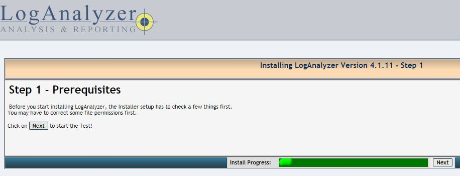

2. Проверка прав доступа к директориям

   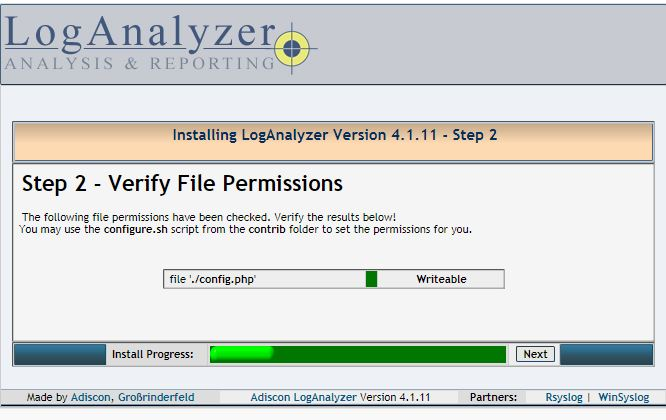

3. Конфигурация пользователя для базы и некоторых дополнительных опций. Вписываем сюда значения из конфигурационного файла **/etc/rsyslog.d/mysql.conf**

   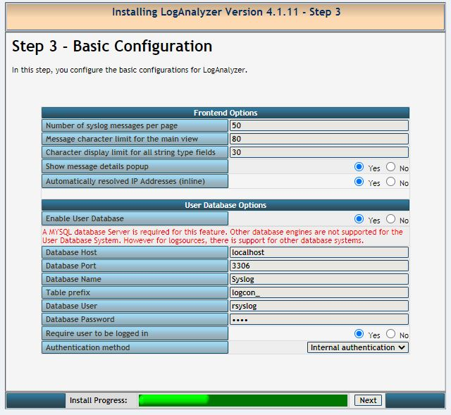

4. Проверка доступов к базе по предоставленному логину/паролю и заливка структуры таблиц, с которыми будет работать **LogAnalyzer**.

   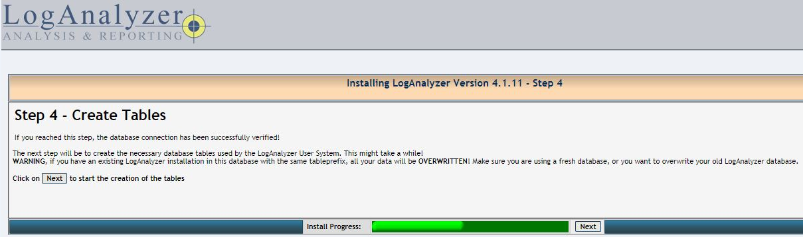

5. Проверка наличия таблиц.

   

6. Создание **администратора** к web-интрерфейсу **LogAnalyzer**.

   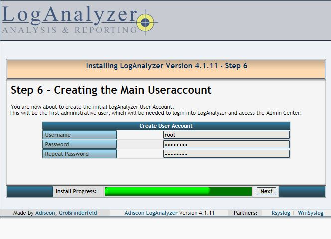

7. Добавляем источник логов для отображения. **LogAnalyzer** умеет показывать записи из текстового файла, базы данных **MongoDB** или **MySQL**. Описываем опции доступа к базе.

   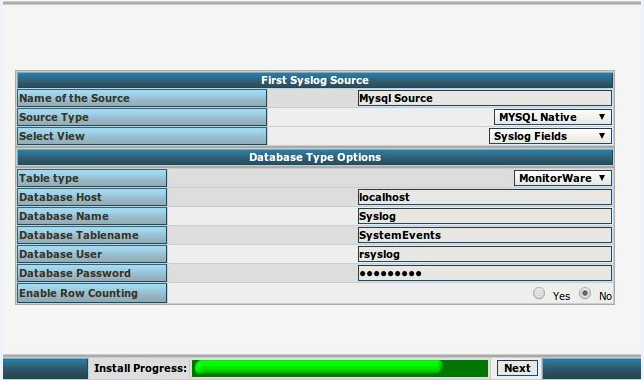

8. Завершение установки

   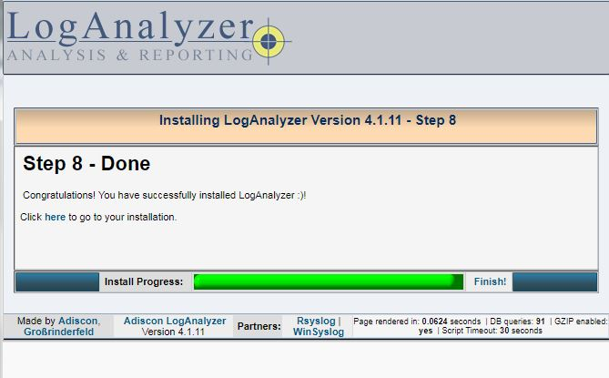

   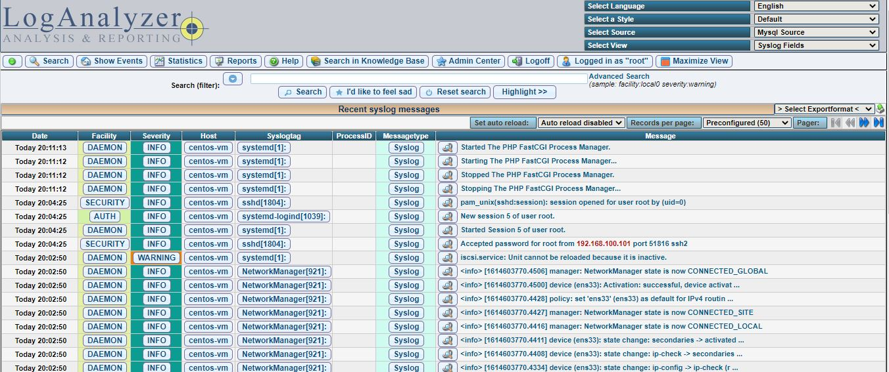


## WEB-конфигурация

* Добавление новых источников: **Admin Center -> Sources**

  Для добавления отдельного текстового лог-файла, необходимо выдать ему права на чтениеб либо изменить владельца или группу, для доступа к нему **apache**

  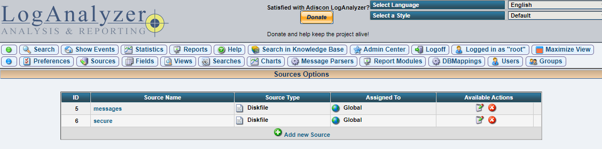

  

  Так же, при добавлении первого источника, база данных теряется из списка. Появляется только после удаления всех новых источников. У них так же отличается пункт о назначении

  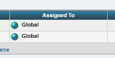

  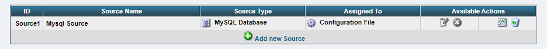


## Источники

https://www.digitalocean.com/community/tutorials/how-to-install-the-apache-web-server-on-centos-7-ru

https://loganalyzer.adiscon.com/doc/install.html

https://loganalyzer.adiscon.com/doc/

https://habr.com/ru/post/213519/

http://feanor184.ru/linux/rsyslog-i-loganalyzer-podnimaem-server-logirovaniya-na-linux.html

https://voxlink.ru/kb/linux/nastrojka-logirovanija-s-pomoshhju-rsyslog-i-loganalyzer/

https://yallalabs.com/monitoring-tools/how-to-install-loganalyzer-adiscon-centos-8/

https://qiwichupa.net/t/foss

https://www.ekzorchik.ru/2018/09/how-to-deploy-loganalyzer-on-ubuntu-18-04/

