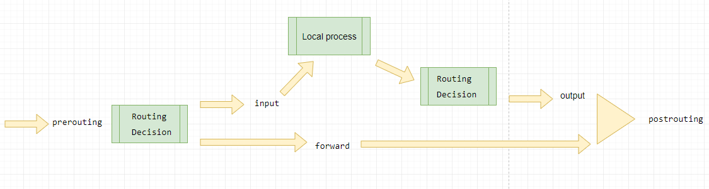

# nftables (CentOS)

---

[nftables](https://netfilter.org/projects/nftables/) — проект **netfilter**, целью которого ставится замена существующего набора межсетевых экранов **{ip,ip6,arp,eb}tables**. Была разработана новая система фильтрации пакетов, добавлена пользовательская утилита **ntf**, а также создан слой совместимости с **{ip,ip6}tables**. **nftables** использует набор **хуков**, систему отслеживания соединений, систему очередей и подсистему логирования **netfilter**.

**nftables** состоит из трёх основных частей: низкоуровневая реализация в составе ядра, библиотека libnl и пользовательский интерфейс nftables. Ядро занимается выполнением правил во время работы межсетевого экрана; для настройки правил в ядро добавлен интерфейс [netlink](https://en.wikipedia.org/wiki/Netlink). Библиотека libnl содержит низкоуровневые функции для взаимодействия с ядром, а в качестве пользовательского интерфейса **nftables** используется утилита **nft**.

Как и фреймворк **iptables**, **nftables** построен на правилах, определяющих действия. Эти **правила** прикреплены к **цепочкам**. **Цепочка** может содержать **набор правил** и регистрируется в хуках netfilter. **Цепочки** хранятся **внутри таблиц**. Таблица специфична для одного из протоколов уровня 3. Одно из основных отличий iptables заключается в том, что больше нет предопределенных таблиц и цепочек.

> **netfilter** - это набор перехватчиков в ядре Linux, который позволяет модулям ядра регистрировать функции обратного вызова в сетевом стеке. Зарегистрированная функция обратного вызова вызывается для каждого пакета, который проходит через каждую ловушку в сетевом стеке.

## Термины

### Tables

* **table** - не более чем контейнер для ваших цепочек.

  Семейства таблиц:

  - **ip** : используется для цепочек, связанных с **IPv4**.
  - **ip6** : используется для цепочек, связанных с **IPv6**.
  - **arp** : используется для цепочек, связанных с **ARP**.
  - **bridge** : используется для соединения связанных цепей.
  - **inet** : смешанные цепочки ipv4 / ipv6 (ядро 3.14 и выше).
  - **netdev** : используется для цепочек, которые фильтруют в начале стека (ядро 4.2 и выше).

### Chains

* **chain** - используются для группировки правил.

  * **базовая цепочка** имеет зарегистрированный крючок, тип и приоритет.
  * **небазовые цепочки** не привязаны к хуку и по умолчанию не видят никакого трафика. Их можно использовать для организации набора правил в дереве цепочек.

  В настоящее время существует три **типа** (***type***) цепочек:

  | Тип цепочки | Семейства     | Хуки                                   | Описание                                                     |
  | ----------- | ------------- | -------------------------------------- | ------------------------------------------------------------ |
  | **filter**  | Все           | Все                                    | Стандартный тип, фильтрация пакетов                          |
  | **nat**     | ip, ip6, inet | prerouting, input, output, postrouting | Цепи этого типа выполняют преобразование NAT собственных адресов на основе записей **conntrack**. Только первый пакет соединения фактически проходит эту цепочку – его правила обычно определяют детали созданной записи conntrack (например, операторы NAT). |
  | **route**   | ip, ip6       | output                                 | Если пакет прошел через цепочку этого типа и собирается быть принятым, выполняется поиск нового маршрута, если соответствующие части заголовка IP изменились. Это позволяет, например, реализовать селекторы маршрутизации политик в nftables. |

  

* **hook** - это представление того, **«где»** (в сетевом стеке) происходит обработка. Другими словами, он выражает время привязки.

  Можно использовать следующие крючки:

  - **prerouting** : это происходит до принятия решения о маршрутизации, все пакеты, входящие в машину, попадают в эту ловушку.
  - **input** : все пакеты для локальной системы попадают в эту ловушку.
  - **forward** : пакеты не для локальной системы, те, которые необходимо пересылать, попадают в эту ловушку.
  - **output** : пакеты, исходящие из локальной системы, попадают в эту ловушку.
  - **postrouting** : эта ловушка возникает после того, как решение о маршрутизации было принято, все пакеты, покидающие машину, попадают в эту ловушку.

  

  > Семейство адресов **ARP** поддерживает только ловушку **input** и **output**.

  > Семейство адресов **Bridge**, похоже, поддерживает только ловушки input, forward и output hook.

* **priority** - относится к числу, используемому для упорядочивания цепочек или для установки их между некоторыми операциями.

  Параметр приоритета принимает целочисленное значение со знаком или стандартное имя приоритета, которое определяет порядок обхода цепочек с одинаковым значением ловушки. **Порядок возрастающий**, т.е. значения с более низким приоритетом имеют приоритет над более высокими.

  В большинстве семейств используются одни и те же значения, но *bridge* использует другие значения.

  | Имя      | Значение | Семейство                  | Хук         |
  | -------- | -------- | -------------------------- | ----------- |
  | raw      | -300     | ip, ip6, inet              | Все         |
  | mangle   | -150     | ip, ip6, inet              | Все         |
  | dstnat   | -100     | ip, ip6, inet              | prerouting  |
  | filter   | 0        | ip, ip6, inet, arp, netdev | Все         |
  | security | 50       | ip, ip6, inet              | Все         |
  | srcnat   | 100      | ip, ip6, inet              | postrouting |

  Для семейства *bridge* существует своя матрица совместимости:

  | Имя    | Значение | Семейство | Хук         |
  | ------ | -------- | --------- | ----------- |
  | dstnat | -300     | bridge    | prerouting  |
  | filter | -200     | bridge    | Все         |
  | out    | 100      | bridge    | Output      |
  | srcnat | 300      | bridge    | postrouting |

* **policy** - это утверждение для тех пакетов, которые явно не приняты или отклонены в содержащихся правилах.
  * *accept* : принять пакет.
  * *drop* : отбросить пакет.
  * *queue* : поставить пакет в очередь в пользовательское пространство и остановить оценку набора правил..
  * *continue*
  * *return* : возврат из текущей цепочки и переход к следующему правилу последней цепочки. В базовой цепочке это эквивалентно **accept**.

### Rules

* **rule** - определяют, какое действие необходимо выполнить для каких пакетов. **Правила** прикреплены к **цепочкам** . Каждое **правило** может иметь выражение для сопоставления пакетов и одно или несколько **действий**, выполняемых при сопоставлении. Другой - по умолчанию счетчики выключены. **Счетчик** должен быть указан явно в каждом правиле , для которого требуется и пакетные байты-счетчики.

  Каждое правило имеет уникальный номер дескриптора, по которому его можно отличить.

  Доступны следующие совпадения (**matches**):

  | Matches     | Описание                                               | Matches   | Описание |
  | ----------- | ------------------------------------------------------ | --------- | -------- |
  | **ip**      | IP-протокол                                            | **Ether** |          |
  | **ip6**     | протокол IPv6.                                         | **Dst**   |          |
  | **tcp**     | протокол TCP                                           | **Frag**  |          |
  | **udp**     | протокол UDP                                           | **Hbh**   |          |
  | **udplite** | протокол UDP-lite                                      | **Mh**    |          |
  | **sctp**    | протокол SCTP                                          | **Rt**    |          |
  | **dccp**    | протокол DCCP                                          | **Vlan**  |          |
  | **ah**      | заголовки аутентификации                               | **Arp**   |          |
  | **esp**     | зашифрованные заголовки полезной нагрузки безопасности |           |          |
  | **ipcomp**  | заголовки IPcomp                                       |           |          |
  | **icmp**    | протокол icmp                                          |           |          |
  | **icmpv6**  | протокол icmpv6                                        |           |          |
  | **ct**      | отслеживание подключений                               |           |          |
  | **meta**    | мета-свойства, такие как интерфейсы                    |           |          |
  

* **Statements** - представляют собой действие, которое должно быть выполнено при совпадении правила. Они бывают двух видов: **терминальные** операторы, безоговорочно завершающие оценку текущих правил, и **нетерминальные** операторы, которые либо условно, либо никогда не завершают текущие правила. Может быть **произвольное количество нетерминальных операторов**, но должен быть **только один терминальный оператор**.
  * **accept** : принять пакет и остановить оценку набора правил.
  * **drop** : отбросить пакет и остановить оценку набора правил.
  * **reject** : отклонить пакет с сообщением **icmp**.
  * **queue**: поставить пакет в очередь в пользовательское пространство и остановить оценку набора правил.
  * **continue**:
  * **return** : возврат из текущей цепочки и переход к следующему правилу последней цепочки. В базовой цепочке это эквивалентно **accept**.
  * **jump <chain>** : продолжить с первого правила <chain>. Он будет продолжен в следующем правиле после выдачи оператора возврата.
  * **goto <chain>** : аналогично прыжку, но после новой цепочки оценка продолжится с последней цепочки вместо той, которая содержит оператор goto.
  

* **handle** - внутренний номер индентифицирующий определенное *правило*.

* **position** - это внутренний номер используемый для вставки *правил* до пределенного *handle*.

## Связанные файлы

- **/etc/sysconfig/nftables.conf** - включение загрузки дефолтной конфигурации хранящейся в директории `/etc/nftables/` (CentOS)

- **/etc/nftables/** - хранит несколько базовых файлов конфигурации **nftables** (main, nat, routers) (CentOS)

## Конфигурирование

## Команды

Управление таблицами

* nft {**add** | **create**} **table** [*family*] *table* [**{ flags** *flags* **; }**]

* nft {**delete** | **list** | **flush**} **table** [*family*] *table*

* nft **list tables** [*family*]

* nft **delete table** [*family*] **handle** *handle*

Команды управления цепочками:

- nft {**add** | **create**} **chain** [*family*] *table* *chain* [**{ type** *type* **hook** *hook* [**device** *device*] **priority** *priority* **;** [**policy** *policy* **;**] **}**]
- nft {**delete** | **list** | **flush**} **chain** [*family*] *table* *chain*
- nft **list chains** [*family*]
- nft **delete chain** [*family*] *table* **handle** *handle*
- nft **rename chain** [*family*] *table* *chain* *newname*

По аналогии с таблицами, цепочки также нужно создавать вручную. При создании цепочки необходимо указать, к какой таблице она относится, а также тип, хук и приоритет.

Команды add и create – добавляют новую цепочку в указанную таблицу. Когда указаны ловушка и значение приоритета, цепочка создается как базовая и подключается к сетевому стеку. Разница между add и create, состоит в том, что create выдаст ошибку если правило уже существует. Delete – удаляет конкретную цепочку, flush – удалит все цепочки в указанной таблице. List – выводит список правил или правила соотносимые с каким то семейством. Rename – переименовывает правило.

Команды управления правилами:

- nft {**add** | **insert**} **rule** [*family*] *table* *chain* [**handle** *handle* | **index** *index*] *statement* … [**comment** *comment*]
- **nft replace rule** [*family*] *table* *chain* **handle** *handle* *statement* … [**comment** *comment*]
- **nft delete rule** [*family*] *table* *chain* **handle** *handle*

Правила добавляются в цепочки в данной таблице. Если семейство не указано, используется семейство ip. Правила состоят из двух видов компонентов в соответствии с набором грамматических правил: **выражений** и **утверждений**.

Команды добавления **add** и вставки **insert** поддерживают необязательный указатель местоположения, который является либо дескриптором handle, либо индексом index (начиная с нуля) существующего правила. Внутренне расположение правил всегда идентифицируется дескриптором, а преобразование из индекса происходит в пользовательском пространстве. Это имеет два возможных последствия в случае одновременного изменения набора правил после того, как преобразование было выполнено: эффективный индекс правила может измениться, если правило было вставлено или удалено перед указанным. Если указанное правило было удалено, команда отклоняется ядром так же, как если бы был задан недопустимый дескриптор.

Комментарий – это одно слово или строка из нескольких слов в двойных кавычках (“), которую можно использовать для заметок, касающихся фактического правила. Примечание. Если вы используете bash для добавления правил, вы должны избегать кавычек, например \ “включить ssh для серверов \”.

## Пример

## Источники

http://manenok.pp.ua/nftables/

https://wiki.gentoo.org/wiki/Nftables#Introduction

https://wiki.nftables.org/wiki-nftables/index.php/Main_Page

https://wiki.nftables.org/wiki-nftables/index.php/Quick_reference-nftables_in_10_minutes

https://wiki.archlinux.org/index.php/Nftables_(%D0%A0%D1%83%D1%81%D1%81%D0%BA%D0%B8%D0%B9)

https://habr.com/ru/company/otus/blog/511122/