### Настройка GRE-туннеля

---

Для создания и настройки GRE-туннеля, будет использоваться **nmtui** (Network-Manager).

#### Настройка

1. После запуска утилиты **nmtui**, перешли в меню редактирования соединений (**Edit a connection**).

   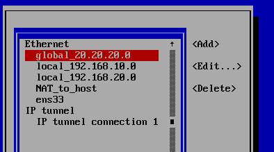

2. Выбрали действие **Добавить** (Add) и указали тип нового соединения как **IP tunnel**.

   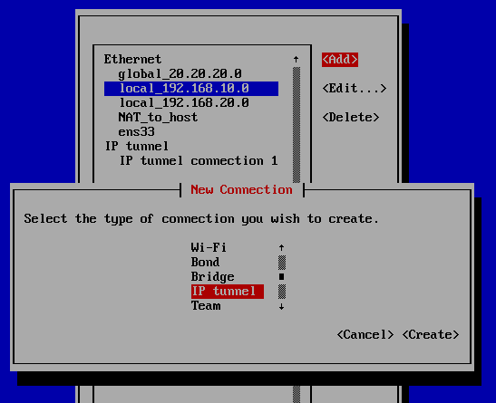

3. Использовали следующие параметры:

   - **Profile name** - название соединения, можно использовать удобное в применении

   - **Device** - наименование устройства, для которого создается соединение. В данном случае будет создан виртуальный интерфейс типа туннель с указанным наименованием

   - **IP tunnel**

     - **Mode** - режим работы туннеля
     - **Parent** - наименование устройства, на основе которого будет работать туннель
     - **Local IP** - адрес локального внешнего интерфейса смотрящего в глобальную сеть
     - **Remote IP** - адрес удаленного устройства в глобальной сети
     - **MTU** - может быть задан вручную, если не задан, то используется значение

     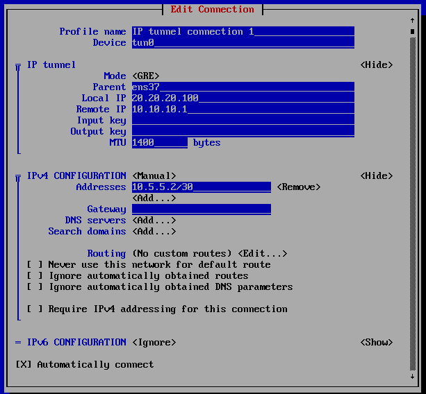

   - IPv4 Configuration:

     - **Режим** - Manual (ручная настройка)
     - **Adresses** - адрес, в данном случае используемый в туннеле
     - **Gateway** - на основе указанного адреса будет создан Default маршрут

   - IPv6 Configuration:

     - **Режим** - Ignore (не настраивается)

4. Новое соединение создано, проверяем его наличие и верное расположение в меню **"Activate a connection"**

   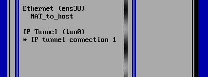

5. Теперь необходимо изменить стандартное значение **TTL** (Time to live) для данного соединения. Для этого будет использоваться утилита **nmcli**.

   После выхода из **nmtui **в окне терминала вводим команду `nmcli connection edit [Имя соединения]`  (поддерживается Tab) и переходим в режим редактирования соединения.

   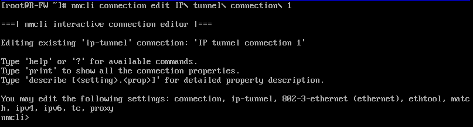

6. Здесь нам необходимо ввести такую команду: `set ip-tunnel.ttl [значение]`. После этого можно проверить значения параметров при помощи команды `print all` или более точечно `print [connection, ip-tunnel, ipv4, ipv6, proxy]`

   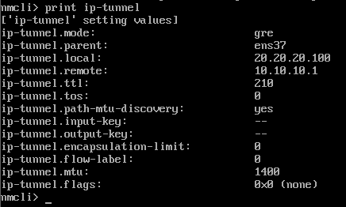

7. Теперь значение необходимо сохранить при помощи команды `save` и можно выходить из режима редактирования `quit`.

8. Те же самые настройки необходимо повторить и на устройстве с противоположной стороны туннеля.

   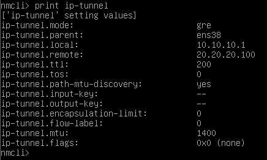

#### Проверка

Значения после команды `ip address`

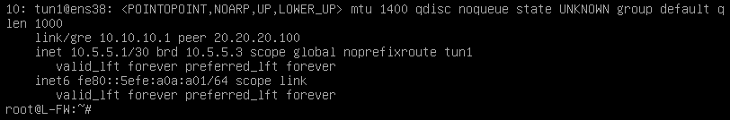

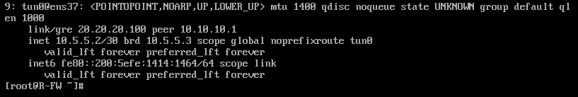

Проверить работу созданного туннеля можно при помощи команды **ping** на адрес используемый в туннеле для удаленного устройства.

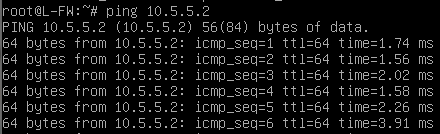

Перехваченные по пути пакеты из GRE-туннеля

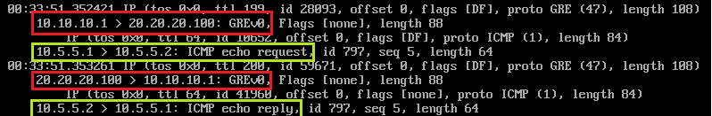