### Проверка GPO (20-21)

---

1. 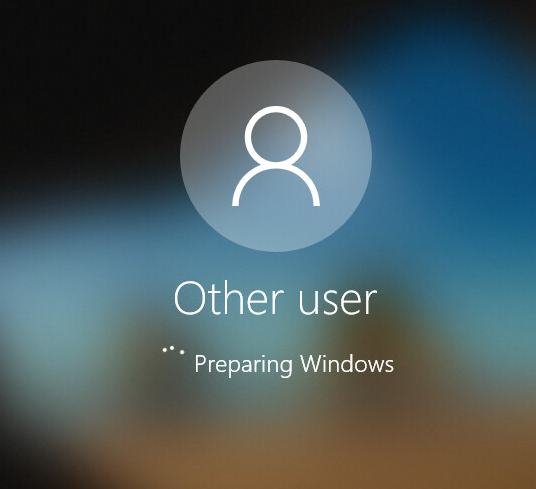

2. * Сервер

     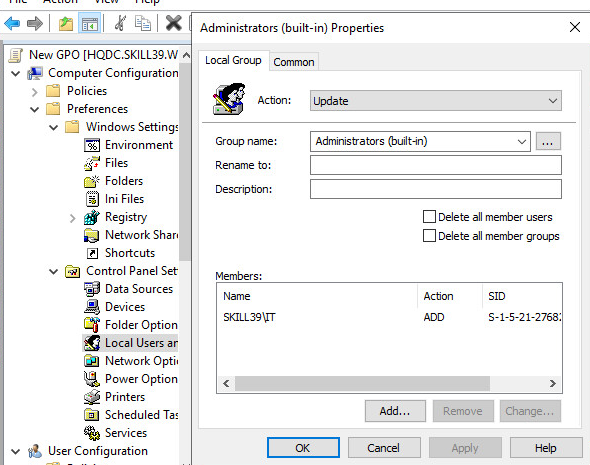

     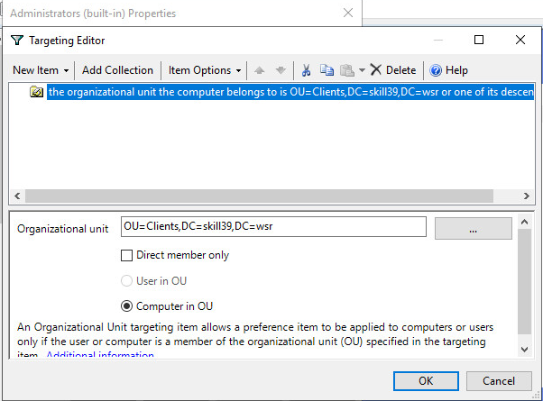

   * Клиент

     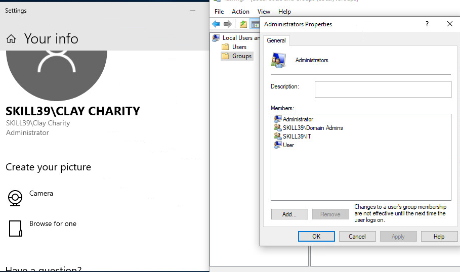

3. 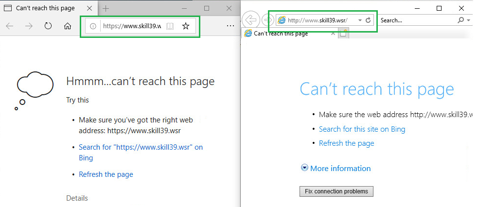

4. * Сервер

     

   * Клиент

     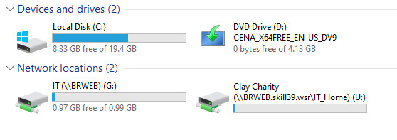

5. * Сервер

     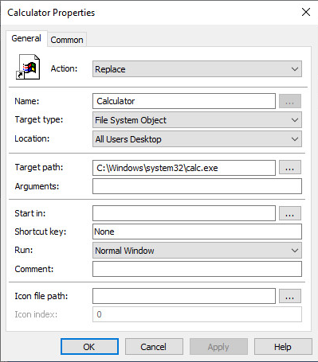

     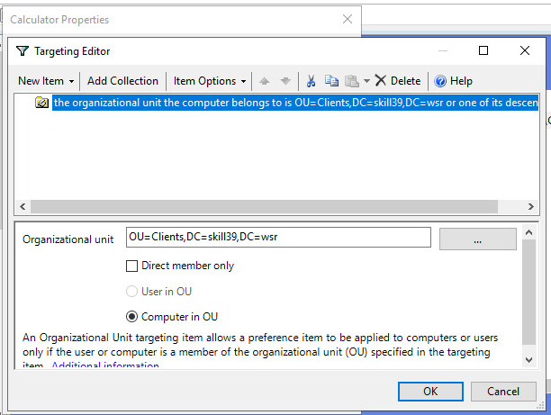

   * Клиент

     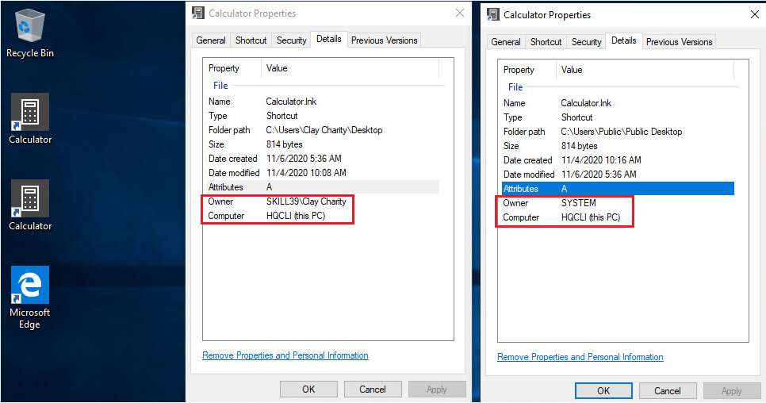

6. * Сервер

     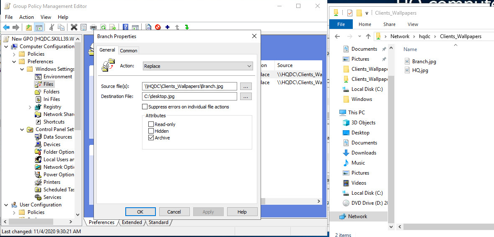

     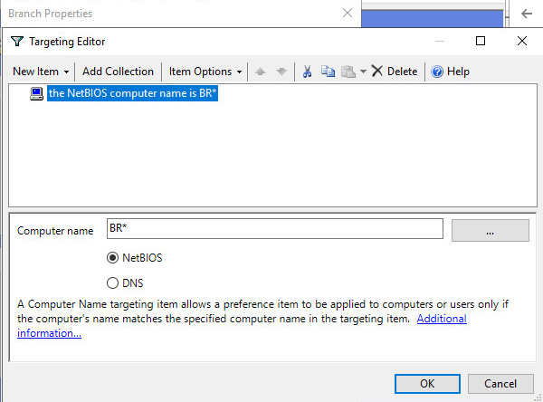

   * Клиент (**HQCLI**)

     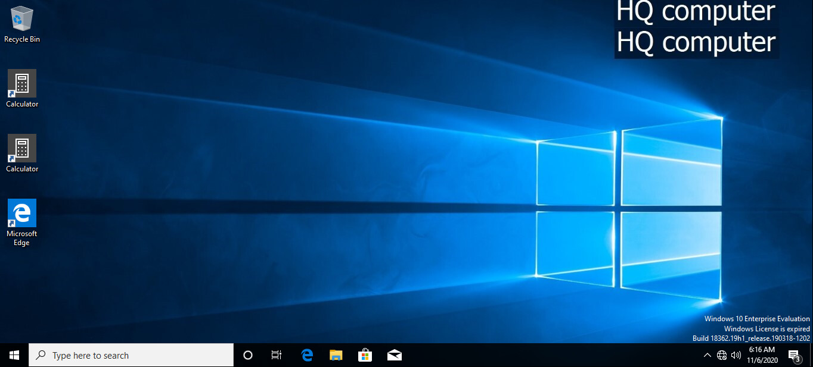

   * Задумка

     Через действие **"Files"** в политике, на каждую машину с NetBIOS именем **"BR*"** и **"HQ *"** будут заливаться соответсвующие каждому шаблону картинки и сохраняться на диске (**С:\desktop.jpg**). В свою очередь, политика на изображение рабочего стола является **Пользовательской политикой**, а значит сами ПК ей неподвластны. Поэтому, на каждом ПК будет сохранен файлик с однаковым у всех названием **desktop.jpg** и он же и будет назначаться изображением рабочего стола этой машины.