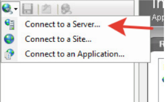
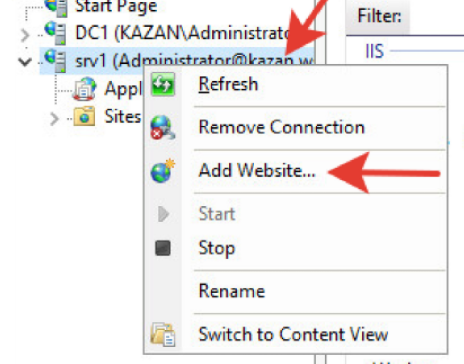
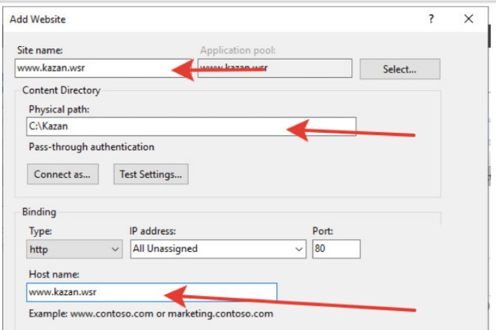
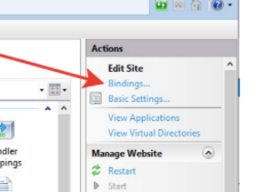
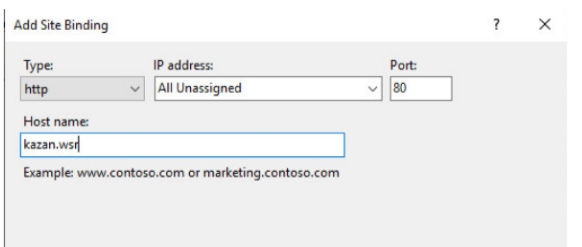
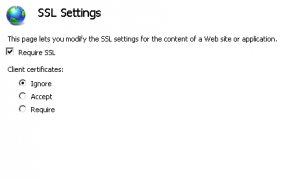
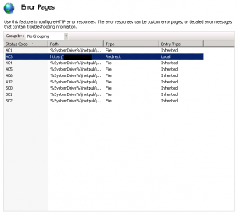
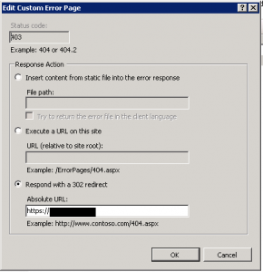

### IIS

---

* При установке роли, установить **Managment Service**
* Если сайт должен работать на **Core**, роль **IIS** необходимо устанавливать еще и на сервер с которого будет осуществляться управление
* На **Core**, после установки ролей, перейти в Реестр (**regedit**): \\\HKEY_LOCAL_MACHINE\Software\Microsoft\WebManagement\Server и поменять значение параметра **EnableRemoteManagement** на 1.
* Через оснастку **MMC** "Computer Management", на сервере **Core** включить сервис **"Web Management Service"** и установить автоматический запуск при старте системы.

#### Настройка

* Создаем папку на диске и в ней создаем текстовый файл, который станет основной страницей сайта (**index.html**). Для доступа к корневому каталогу удаленного сервера необходим путь **''\\\srv\c$''**

* Переходим из Диспетчера Серверов в оснастку **"Internet Information Services (IIS) Manager"**

* Добавляем в список доступных сервером сервер Core
  

* 

* 

#### Доступность по другим именам

* Доступ через http по имени kazan.wsr

  

#### Перенаправление на HTTPS (принудительно)

1. Включить настройку **"Require SSL"** для сайта

   

2. В конфигурации настроек ошибок для **403** ошибок установите его в **"respond with 302 redirect"** с новым URL набором в полный URL с префиксом **https://...** .

   

   