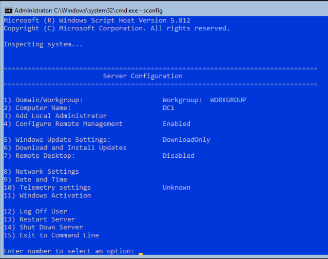
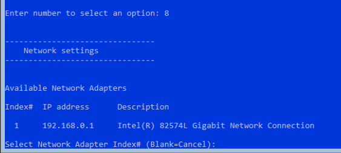
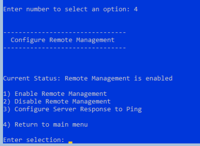

#### Разобраться с Core версией Windows Server

В Windows Server 2016 (а говорят, что появилось еще в 2008 R2) и выше для настройки нескольких общих аспектов установки основных серверных компонентов и управления ими можно использовать средство настройки сервера **(Sconfig.cmd)**. Чтобы использовать это средство, вы должны быть членом группы "Администраторы".

##### Запуск средства настройки сервера

1. Перейдите в корневой каталог системного диска.
2. Введите `Sconfig.cmd`  (или `sconfig`). Откроется интерфейс средства настройки сервера:

   

Если пользователь домена **не был добавлен в группу локальных администраторов**, вы не сможете с его помощью изменять системные параметры, такие как имя компьютера. Чтобы добавить пользователя домена в группу локальных администраторов, разрешите перезагрузку компьютера. Далее войдите на компьютер в качестве локального администратора и выполните действия.

* Чтобы изменить имя компьютера, перейдите на страницу **Computer Name** (Имя компьютера) из главного меню и следуйте инструкциям.

* Вы можете настроить автоматическое назначение IP-адреса DHCP-сервером или вручную назначить статический IP-адрес пользователя (**Network Settings**). Этот параметр позволяет также настраивать параметры DNS-сервера для сервера.

  

* Вы можете разрешить различные сценарии удаленного управления с помощью параметра главного меню **Configure Remote Management** (Настройка удаленного управления):

  - Удаленное администрирование с помощью консоли управления (MMC)
  - Windows PowerShell
  - Диспетчер серверов

  