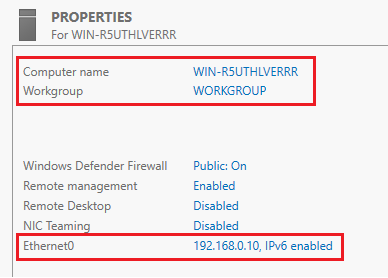
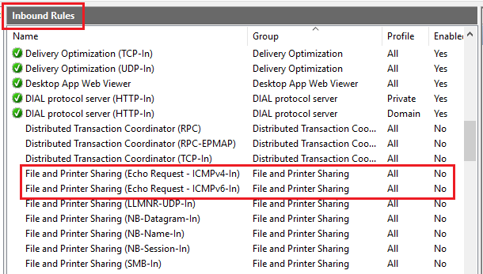

#### Разобраться с GUI Windows Server

Изменение имени, редактирование настроек сети:

1. Перейти в **Server Manager**

2. **Local Server**

   

Разрешение **входящих эхо-запросов**:

1. Перейти в **Server Manager**

2. Вкладка **Tools** > **"Windows Defender Firewall with Advanced Security"**

3. Раздел **Inbound Rules**

4. Необходимо включить правило **"File and Printer Sharing (Echo Request - ICMPv4-In)"** (или **"...ICMPv6-In"**)

   

